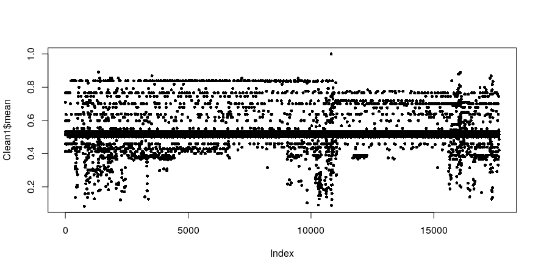
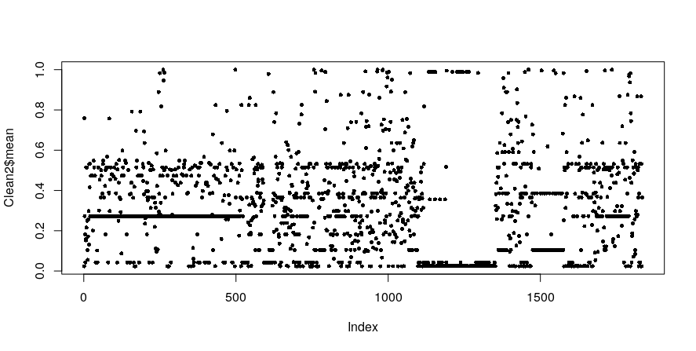
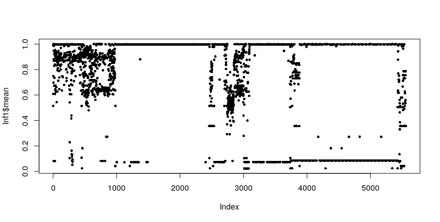
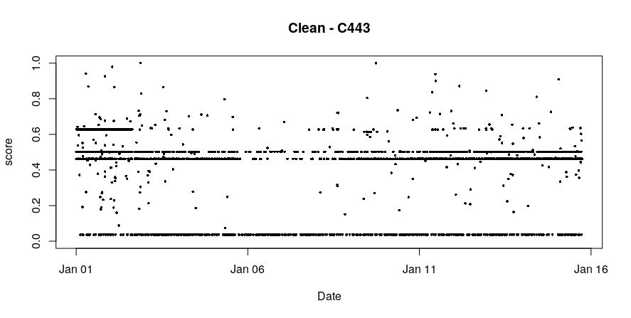
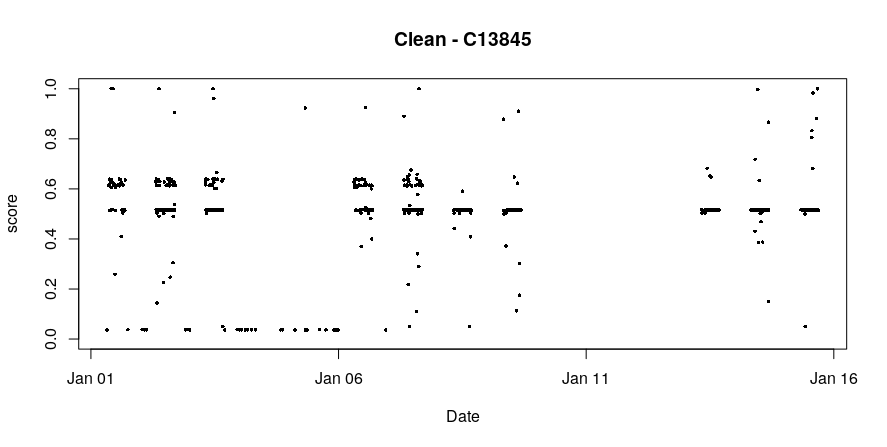
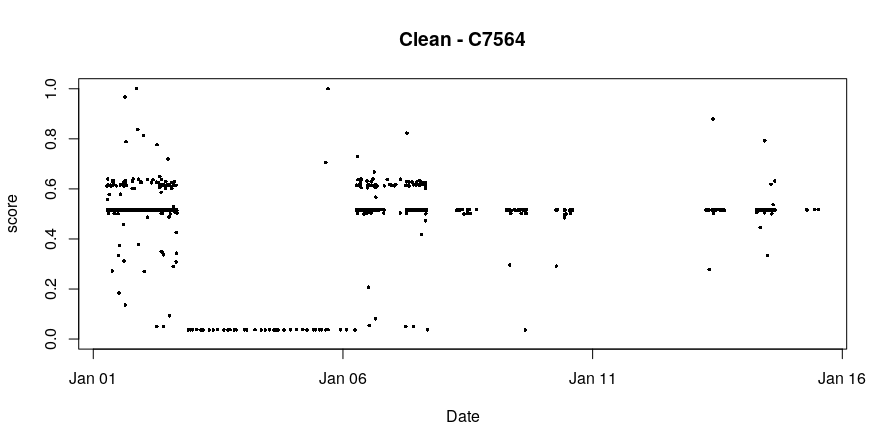
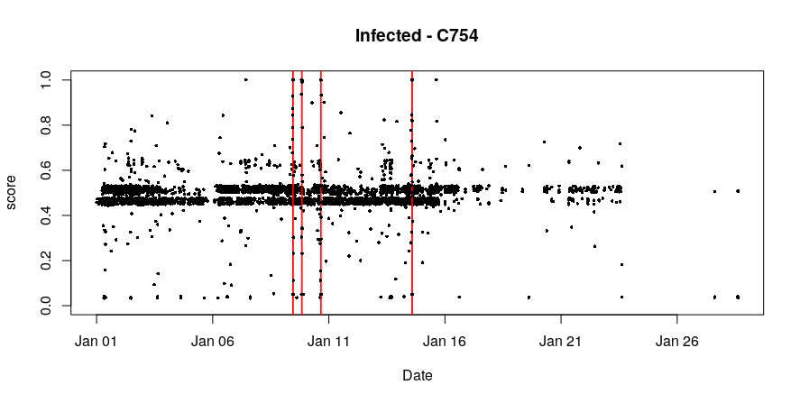
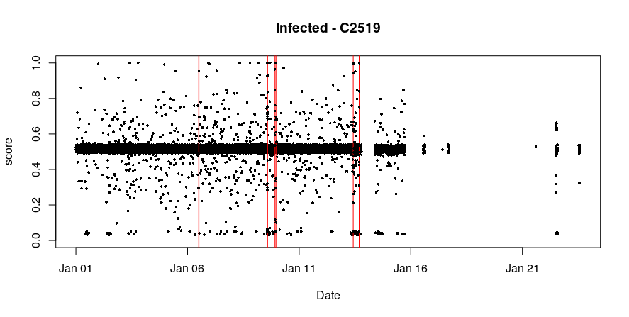

---

### Current thoughts on modeling approach

A major concern of reviewers was that the dataset is 
	1. small,
	2. synthetic,
	3. highly unbalanced,

so in other words not representative for real-world traffic, and that the unbalanced nature of the dataset hides the shortcomings of the model. To bolster the results, I applied the same methods (with some parameters tweaked for the RNN) to the dataset from the Los Alamos National Laboratory network (LANL). This is a dataset containing netflows from their corporate, internal computer network, and thus contains real-world traffic. It also contains attacks carried out by a "red team" on several machines in the network. These attacks are not synthetic, but stem from actual attacks, although it is not clear if they are representative for attacks from rogue agents.

To apply the methods to this dataset, I selected a set of machines with attacked and unattacked ones for comparison. As the network addresses are not labelled as to what kind of device they represent, I had to look for machines that appear to have behaviour and traffic of a personal computer. I am not sure if the methods are appropriate to other devices with less diverse traffic? 

As the traffic is purely internal, the number of destination ports responsible for the majority of the traffic is a lot higher, i.e. port 80, 443, etc. do not account for as much traffic as in the CTU data. For a number of computers, only about five ports had traffic percentages of more than 1 percent, so it seems that random destination ports are more common than in the CTU data. As I was not 100% sure at what kind of devices I was looking at, I partly selected the machines to have a port distribution closer to the CTU machines in order to fit the RNN, however I am not sure if this is 100% appropriate.

The LANL dataset has far less attack traffic compared to benign one (which is a lot more realistic), it does not seem appropriate to classify machines as malicious based on the average score of the sessions in the test set as the score from malicious instances would be almost completely depleted by all the benign sessions. Instead, the LANL data contains relatively accurate timestamps of the attacks, it is thus a lot easier to compare the flagged sessions with the ground truth labels. 

If we just compare the scores along 

I am in general a bit sceptical about the averaging of session scores for the detection:
Although it is probably the best way to proceed with the CTU data, I think it is not a realistic approach as attacks attacks are usually far more scarce. It also removes the human ability to investigate flagged machines when the individual traffic instances is not marked. I think this is an issue that was criticised and will likely be again criticised upon submission, so we need to justify this a bit more. 

*Uninfected computer from CTU data*

{ width=70% }

*Another uninfected computer from CTU data*

{ width=70% }

*Infected computer from CTU data*

{ width=70% }

*Clean computer from LANL data*

{ width=70% }

*Clean computer from LANL data*

{ width=70% }

{ width=70% }

{ width=70% }

{ width=70% }