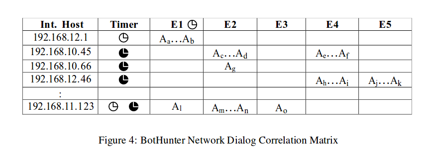
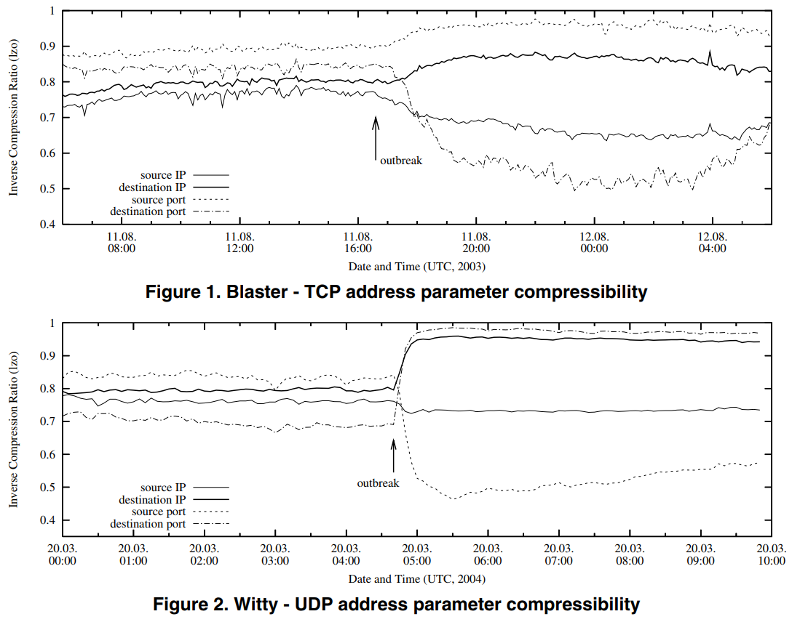
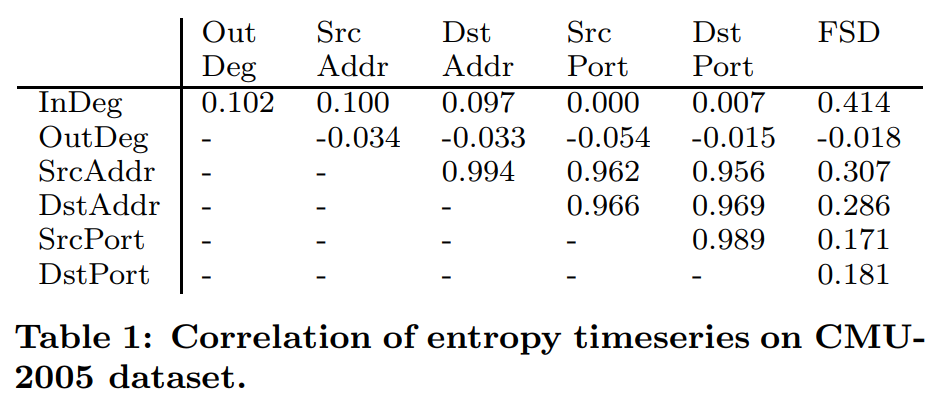
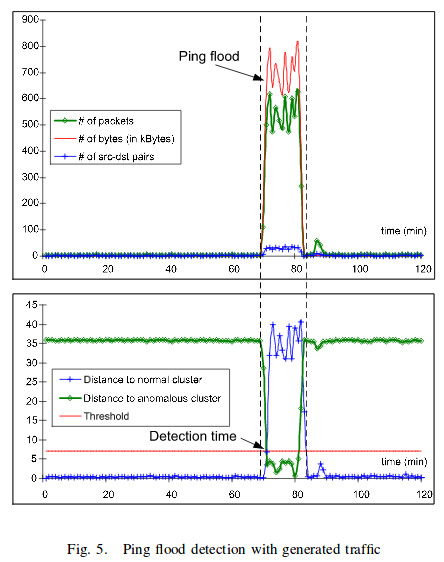
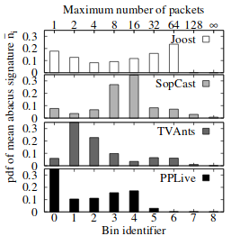

```{r setup, include=FALSE}
knitr::opts_chunk$set(echo = TRUE)
```

# Datasets

### 1999 DARPA IDS dataset
+ Outside sniffing data ( Tcpdump format )
+ Inside sniffing data ( Tcpdump format )
+ BSM audit data ( From pascal )
+ NT audit data ( From hume )
+ Long listings of directory trees ( From pascal, marx, zeno, and hume )
+ Dumps of selected directories ( From pascal, marx, zeno, and hume )
+ A Report of file system inode information ( From pascal )
  
Critique:

+ no validation of their test data 


# Anomaly Detection

## Anomaly Detection: A Survey
##### VARUN CHANDOLA, ARINDAM BANERJEE, and VIPIN KUMAR, 2009
##### University of Minnesota, 5000 citations, 58 pages

Challenges:

+ Defining a normal region that encompasses every possible normal behavior is very
difficult. In addition, the boundary between normal and anomalous behavior is of-
ten not precise. 
+ When anomalies are the result of malicious actions, the malicious adversaries of-
ten adapt themselves to make the anomalous observations appear normal
+ In many domains normal behavior keeps evolving
+ Availability of labeled data for training/validation of models used by anomaly detec-
tion techniques is usually a major issue.
+ Often the data contains noise that tends to be similar to the actual anomalies and
hence is difficult to distinguish and remove.

+ Extends research of Agyemang et al. [2006] and Hodge and Austin
+ The discussion of applications of anomaly detection reveals that for most application domains,
the interesting anomalies are complex in nature (same for us), while most of the algorithmic research has focussed on simple anomalies 


Types of Anomalies:

+ Point anomalies: One individual data-point can be identified as anomalous with respect to the rest of the data
+ Contextual anomaly: A data point is only anomalous in a specific context of the surrounding data
+ Collective Anomalies: A collection of related data instances is anomalous, wihtout the individual data points being particularly anomalous

Supervised anomaly detection: train classifier to train into normal class vs anomalous class
Issues:

+ Anomalies are fewer, classifier imbalanced
+ Not adaptive
+ Getting labels is challenging

Semisupervised Anom. det.: 

+ Only labels for normal class
+ Build model for the normal instances, then find deviations

Unsupervised Anom. det.:

+ Outputs are usually either scores or labels (normal vs anomalous)


Methods that were used in Host-based intrusion detection:

+ Statistical profiling with Histograms
+ Support Vector Maschines
+ Neural networks (1998)
+ Rule based systems
+ Mixture of models (2000)

#### Classification based methods

Assumption: A classifier that can distinguish between normal and anomalous classes can be learned in the given feature space.

Advantages:

+ powerful algorithms that can identify different classes
+ testing phase is fast

Disadvantages:

+ Assign labels, sometimes not backed by probabilistic reasoning (scores might be better to investigate)
+ Need labels for multiclass normal data


Neural Networks for Anomaly detection:

+ Often, Replicator NNs used:
  + Feed forward with equal input and output layers, and compressing layer
  + Train to reproduce the output with quadratic reconstruction error
  + If reconstruction error too big --> Anomalous
+ Other networks: Hopfield, Boltzmann, Adaptive Resonance THeory based, radial basis function based, neural trees, associative networks


Bayesian Networks: 

+ Like naive bayes with multiple labeled normal classes
+ Prior probability for all classes AND for anomalous
+ --> posterior distribution indicates if it belongs to a class or to anomalous
+ Either discrete and independent data (trivial case), or more model specification how to capture dependence etc. necessary 

SVMs: 

+ Create normal region
  + If data point lies outside, it is anomalous
  + Usually: find smallest hyper-sphere to include all data points
  + Robust SVMs are robust against outliers in training data (why would we want that?)
  + If normal data has different regions (for example for different behaviours), anomalies could lie in between --> would lie within the hyper-sphere

Rule-based: 

+ Decision trees
+ Each rule has a confidence value proportional to ratio of correct classification and number of training instances
+ Unsupervised rule-mining for one-class anomaly detection exists:
  + support treshold to drop rules with low support in order to detect strong patterns
+ Fast to train!

+ *Even if labels for both normal and anomalous data is available, the imbalance in two distibutions makes learning a classifier hard*
+ *Semi-supervised nearest neighbor and clustering techniques that only use normal data labels can often be more effective than classification based techniques*


### Unsupervised

#### K-Nearest neighbor

+ Assumption: Normal data instances occur in dense neighborhoods, while anomalies occur far from their closest neighbors.
+ ANomaly score as distance from k nearest neighbors
+ O(N^2) --> bad
+ Pre-Clustering gives O(MN)
+ All work-arounds generally scale badly
+ Advantages:
  + Unsupervised in nature and non-parametric (no assumption about generative distr.)
  + Very adaptive to different types of data (just needs redefinition of distance)
+ Disadvantages:
  + If there is normal behaviour that does not occur very often --> high false positive rate
  + Computational burden
  + Distance measure not always obvious
  + Arbitrary anomaly treshold
  
#### Clustering

+ Assumption: Normal data instances belong to a cluster in the data, while anomalies do not belong to any cluster. Normal data instances lie close to their closest cluster centroid, while anomalies are far away from their closest cluster centroid
+ Techniques:
  + Self-Organizing Maps (Neural Networks) (apparently often used)
  + K-means Clustering
  + Expectation Maximization (Gaussian Mixture Models)
+ Big problem: Anomalies in the training data
  + Robust techniques exist
+ If Anomalies form cluster themselves, we need semi-supervised techniques (like labelled normal data)
+ Computationally often better than k-nearest (since only distances from centroid have to be calculated), O(N*d) for k-means or GMM
+ Advantages:
  + No need for labels (if anomalies don't form clusters)
  + Fast testing phase (since thresholding anomalies is easily done)
+ Disadvantages:
  + Performance of clustering-based techniques is highly dependent on the effectiveness
of clustering algorithms in capturing the cluster structure of normal instances.
  + Some algorithms force every data point to be in cluster --> anomalies getting assigned to a large cluster, thereby beingconsidered as normal instances by techniques that operate under the assumption that anomalies do not belong to any cluster.
  + Some algos are computationally O(N^2)
  
#### Statistical techniques:

+ Assumption: Normal data instances occur in high probability regions of a stochastic model, while anomalies occur in the low probability regions of the stochastic model.

Parametric: 

+ Score is inverse of likelihood, or anomaly is found with rejected hypothesis test (ultimately same thing)
+ Models:
  + Gaussian (normal data comes from gaussian distr.)
  + Split data in train and test, fit a regression onto one variable, and then analyze AIC (?)
    + There have to be no outliers in training?
    + Robust regression techniques exist  
    + For time-series: ARIMA (robust)
    + Mixture models (really like GMM)

Non-parametric:

+ Histogram:
  + Popular for intrusion detection (but older papers)
  + Anomaly score based on the height of the bin, or just anomalous if not in bin
  + High false-alarm rate for too small bins
  + Normal data has to build the bins (or the anomalous data must be very spread)
+ Kernel function based: 
  + Also density estimation, likelihood is then anomaly score
  + Potentially quadratic cost
  
Advantages:

  + Confidence intervals
  + Justified 
  + Can be unsupervised when robust
  
Disadvantages:

  + Finding the right model that holds is difficult
  + Hypothesis tests for high-dimensional data is nontrivial
  + Effective only when dimensionality is low 
  
#### Information theoretic techniques

+ Assumption: Anomalies in data induce irregularities in the information content of the data set
+ Find minimal subset $I\in D$ of all events such that the complexity of the data $C(D)-C(D/I)$ becomes maximum
+ Two objectives (minimal $I$ and maximal complexity)
+ All $I$ are then anomalous
+ Complexity measures include the compressed size of a file (with any compression algo) and entropy
+ Advantages:
  + Unsupervised
  + No model assumptions
+ Disadvantages:
  + Highly dependent on information measure
  + Information quantification can rely on size of substructures (like in sentences or spatial data), nontrivial to obtain
  + Difficult to associate anomaly score (since optimum is not unique)
  
#### Spectral dimensionaly reduction

+ Assumption: Data projection into lower space makes anomalies stand out
+ Techniques: 
  + PCA
  + Robust PCA
  + Compact Marix Decomposition
+ Complexity: Linear in data, quadratic in dimension 
+ Advantages: 
  + Good for pre-procession and high dimensional data
  + Unsupervised
+ Disadvantages: 
  + Only useful if anomalies are separable in lower dimensional embedding
  + Not adaptive to new anomalies (not written in there, but relevant for us) since lower dimension projection is determined by all data, new anomalies might not be separated well in lower dimensional space but might be separable in higher space (the deviation is not captured by projection)

#### Contextual anomalies

+ Techniques:
    + Group together and analyze within peer group (for detection fraud, group users together according to behaviour and analyze within group)
  + Spatial data:
    + Graph-based, use Grubb's score to detect point anomalies within a spatial neighborhood
  + Time series:
    + Moving average comparison for time series
    + Transformation into phase space using time delay embedding process (to translate temporal relations in data into phase space), then use one-class svm
    + All standard techniques like ARMA, auto-regressiv, ARIMA
    + Detect a single anomalie using splitting of series and inspecting the  part with highest Kolmogorov complexity --> End up with single event
    + Use prediction of event from previous events
      + frequent itemset mining, finite state automata, markov model
      + HMM to model switching between normal and anomalous behaviour, estimation with MCMC
      
#### Evaluation
+ *Clustering, classification, and statistical techniques have low testing time, in contrast to knn, information based, and spectral techniques*
+ *For intrusion detection, anomalous worm traffic is actually more frequent than normal traffic*
+ *Only Supervised and semi-supervised models are suitable for bulk anomalies*

## Anomalous Payload-Based Network Intrusion Detection
##### Ke Wang and Salvatore J. Stolfo , 2004
##### Columbia University, 900 citations, 20 pages

+ On 1999 DARPA IDS dataset
+ On live dataset they collected at Columbia network (erased afterwards for privacy reasons)

+ Aim to detect first occurrences of a worm either at a network system gateway or within internal network to prevent propagation
+ First learn model of normal payloads specific to the network
+ Byte frequency distributions for each payload
+ Mahalanobis distance of the finite, discrete histogram of frequencies 

+ Separate models according to ports
+ TCP packets have lengths from 0 to 1460
  + Compute payload models for each length range (since the byte distribution for longer packets is different than for shorter)
  
+ N-gam analysis (just for n=1?):
  + Sliding window of length n over bytes
  + Occurrence of each n-gram is counted (much more data needed for n>>1??)

+ Feature vector of a payload is the frequency count of each n-gram
  + Compute mean and standard deviation of each frequency
  
+ "Mahalanobis distance is a standard distance metric to compare two statistical distributions"
  + $d^2(x,y)=(x-y)^T C^{-1}(x-y)$, $C$ is the covariance matrix
  + Too high distance indicates anomalie of the payload
  + Smoothing factor to Mah. distance to avoid deviations equalling zero:$\sigma_i\rightarrow \sigma_i+\alpha$

  
+ To reduce sparseness problem in individual models (due to lack of data?), cluster similar models $M_{ij}$ with length bin $i$ and port $j$ together using Manhattan distance of the distributions, then borrow data from similar models to model distribution of each model more accurately

##### Results
+ Darpa:
  + Filtered 2.4 million packets, 49.000 connections with nonzero length payloads
  + Clustering applied
  + Smoothing apparently reduces overfitting?
  + Clustering with manhattan distance treshold of 0.5
  + Anomaly treshold of 256
  + About 60 % detection rate with false positive rate of 1%
  + almost 100% for http with 0.1% false positive
  
+ Own data more ambiguous (because they apparently uploaded many pdfs which have many non-printable characters)
  + Apparently not working for anything else than http, but there 95% accuracy and 0.1 false positive

### A Data Mining Framework for Building Intrusion Detection Models
##### Wenke Lee, Salvatore J. Stolfo, Kui W. Mok , 2004
##### Columbia University, 1600 citations, 13 pages

+ "Meta-learning is used
to learn the correlation of intrusion evidence from multiple
detection models, and produce a combined detection mod-
els."

+ "There are several important reasons for combining multi-
ple detection models. First, in order to avoid becoming a
performance bottleneck and an easy target of “subversion”,
an IDS should consist of multiple cooperative lightweight
subsystems that each monitor a separate part (e.g., access
point) of the entire network environment."

+ "We believe that the best way to make intrusion detection
models adaptive is by combining existing models with new
models that are trained on new intrusion data or new nor-
mal data (e.g., audit data from a new network component),
instead of restarting the entire model building process using
the aggregate of the archived audit data and new data."

+ Many good ideas, but only talks very briefly about them, for example pattern mining for user behaviour, and then comparing them using a similarity score ($n/m$), but no details

### Snort – Lightweight Intrusion Detection for Networks
Signature based
Finds:

+ operating system fingerprinting attempts
+ semantic URL attacks
+ buffer overflows
+ server message block probes
+ stealth port scans

Squeal attacks:
+ Noise-Masked Attacks: By producing a large number of false positives with varying sourceaddresses and signature patterns, “squealing” could be used to conceal a real attack.  This is especially true if “squealing” is used to divert attention from another covert attack. 
+ Attack  Misdirection: Falsifying the source of an attack using spoofed packets. For example, machine H (Hacker) could make it appear like entity X is attacking entity Y when it is not the case. 
+ Evidence Reputability Attack: “Squealing” has the effect of repudiating all evidence provided by signature-based IDS due to both high false alarms rates and strategically implanted false alarms. 
+ Target Conditioning Attack: If found non-malicious, previous alarm patterns are often used for filtering false positives. Machine H could condition entity X’s security administrator to become accustomed to activity A.  The security administrator investigates and flags activity A as a false positive.  Eventually, after machine H has conditioned entity X to ignore activity A, machine H uses activity A to exploit a vulnerability. 
+ Statistical Poisoning Attack: Intentionally feeding incorrect data to anomaly IDSs to shape statistical benchmarks especially when training a system.  

### Spade - Detecting the unknown with snort and the statistical packet anomaly detection engine - 2003

+ Snort plug-in
+ Maintains probability-tables of that contain information regarding the number of occurrences of different kinds of packet over time on the network. It assigns a higher weight to more recent occurrences, and gradually phases out older occurrences

+ Detects:
  + closed-dport
  + dead-dest
  + odd-dport - Unused port occurs
  + odd-port-dest - Traffic that has gone over one specific port suddenly changes destination IP
  + odd-typecode - odd ICMP packets on the network


### BotHunter: Detecting Malware Infection Through IDS-Driven Dialog Correlation
##### Guofei Gu, Phillip Porras, Vinod Yegneswaran, Martin Fong, Wenke Lee , 2007
##### Georgia Tech, 893 citations, 16 pages

+ a bot is a self-propagating application that infects vulnerable hosts through direct exploitation or Trojan insertion
+ bot has command and control channel
+ distinguishing a successful local host infection from the daily myriad of scans and intrusion attempts is as critical and challenging a task
+ While we argue that bot infections do regularly follow a series of specific steps, we find it rare to accurately detect all steps, and find it equally difficult to predict the order and time-window in which these events are recorded.

+ Evidence-trail approach: recognise infection through communication sequences during infection process
+ Bot infections are modeled as a set of loosely ordered communication flows that are exchanged between an internal host and one or more external entities
+ All bots modelled as sharing a common set of underlying actions during infection life cycle:
  - E1: target scanning
  - E2: infection exploit
  - E3: binary egg download and execution
  - E4: command and control channel establishment
  - E:5 outbound scanning
+ not all event required or have to be detected

Framework:

+ Uses snort with customized rules + two plug-ins:
  + SLADE: Statistical payLoad Anomaly Detection Engine
  lossy n-gram payload analysis, targeting the byte-distribution
  + SCADE: Statistical sCan Anomaly Detection Engine
  port-scan analysis on incoming and outgoing traffic
    + Detects local hosts that conduct high-rate scans across large sets of external addresses.
    + Detects abnormally high connection fail rates, with sensitivity to HS port usage. We calculate the anomaly score s2=(w1Fhs+w2Fls)/C, where C is the total number of scans from the host within a time window.
+ Sequence of warnings that occur between each local host and external entities
+ Dialog warnings are tracked over a temporal window, where each contributes to an overall infection sequence score that is maintained per local host
+ interval-based pruning algorithm to remove old dialog from the matrix
+ Warnings for E1-E5 come from signature engine (SLADE. SCADE, Snort)
{ width=70% }
+ dialog threshold score
+ When enough alerts are found to match dialog model, flag attack
+ Thus a new network perimeter monitoring strategy

+ Tested in virtual network and live honeynet  
+ very low false positive rates
+ Tested with well-known bots (and also emerging ones?)
+ Admitted that easy to evade bothunter (encrypted traffic, stealthy scanning, basically losing the current signature)

### Outside the Closed World: On Using Machine Learning For Network Intrusion Detection
##### Robin Sommer, Vern Paxson, 2010
##### Berkeley, 650 citations, 12 pages

+ focus on network intrusion detection, though we believe that similar arguments hold for host-based systems
+ Monitoring network activity for anomalies: deviations from profiles of normality previously learned from benign traffic
+ machine learning is rarely employed in operational “real world” settings

+ significant part of the problem originates in the premise that anomaly detection is suitable for finding novel attacks
  + the space for representing other applications of anomaly detection is of relatively low dimensionality and semantically much more well-defined than network traffic
+ the strength of machine-learning tools is finding activity that is similar to something previously seen, without the need however to precisely describe that activity up front (as misuse detection must), (debatable)

Well-known problems:

+ Hard to build a perfect model of normality, closed world assumption
  + Classification much easier (they keep praising classification over anomaly detection), model does not have to be perfect to give good results
  + "anomaly detection is likely in fact better suited for finding variations of known attacks, rather than previously unknown malicious activity."
    + Basically recognition of attacks with background noise
+ detectors tend to generate numerous false positives, 
  + high cost of errors for both false positives and false negatives
  + Most models lack semantic gaps to give immediate understanding of the alert, making it impossible to properly test and calibrate the system on real world daat9
+ Network traffic is incredibly diverse and variable
  + basic characteristics such as bandwidth, duration of connections, and application mix can vary immensely
  + Researchers often use aggregation to reduce variability: volume per hour”, “connections per source”
    + often straight-forward to find anomalies with other approaches like tresholding
    + researchers often fail to examine whether simpler, non-machine learning approaches might work equally well
  + traffic diversity is not restricted to packet-level features, extends to application-layer information: 
    + Syntactically, protocol specifications often purposefully leave room for interpretation, and in heterogeneous traffic streams there is ample opportunity for corner-case situations to manifest
    + Semantically, features derived from application protocols can be just as fluctuating as network-layer packets
      + If google or any other mayor website changes the way they distribute packet information transfer, how will this affect a behavioural model
+ Lack of data with ground truth, truly attack-free data for training is equally hard to find as real world data with labelled attacks
  + attackers can evade detection by gradually teaching a system to accept malicious activity as benign (lot of effort?)

Recommendations:

+ Keeping the scope narrow
  + without a clear objective, no anomaly detection system can achieve a tolerable amount of false positives
    +  limiting false positives must be a **top priority** for any anomaly detection system
  + A common pitfall is starting with the premise to use machine-learning (or, worse, a particular machine-learning approach) and then looking for a problem to solve
+ reduce false positives by post-processingthem with the support of additional information
+ Insight into systems capabilities
  + "What can it detect, and why? What can it not detect, and why not? How reliably does it operate? Where does it break? In our experience, the #1 reason that conference submissions on anomaly detection fail arises from a failure to adequately explore these issues"


+ The observation that machine learning works much better for such true classification problems then leads to the conclusion that anomaly detection is likely in fact better suited for finding variations of known attacks , rather than previously unknown malicious act ivity. In such settings, one can train the system with specimens of the attacks as they are known and with normal background traffic, and thus achieve a much more reliable decision process


+ Likely the most important step towards fewer mistakes is reducing the system’s scope

+ Always compare to more simplistic things like spam or credit fraud, I believe that the comparison really lacks context, there are better examples for the application of anomaly detection
+ "Fundamentally, machine-learning algorithms excel much better at finding similarities than at identifying activity that does not belong there" Also quite biased, basically saying that statistical anomaly detection is lacking good results (which is not true)
  + However, I highly agree that a context of the anomalies is absolutely necessary
  + "closed world assumption" (that we can quantify all existing benign cases)
  + I also agree that we should definitely use existing knowledge of malware in an appropriately abstract way to incorporate information on the anomaly side (attacks won't change fundamentally from one day to the other, or you need much more understanding of the current vulnerabilities to make good proedictions about the unknown unknowns)

### Learning and Classification of Malware Behavior
##### Konrad Rieck, Thorsten Holz, Carsten Willems, Patrick Dussel, Pavel Laskov, 2008
##### Fraunhofer Institute, 480 citations, 18 pages

+ variants of malware families share typical behavioral patterns reflecting its origin and purpose
+  In contrast to static techniques, dynamic analysis of binaries during run-time enables monitoring of malware behavior, which is more difficult to conceal. 
  + Ability needed to automatically infer characteristics from observed malware behavior
+ Questions to be answered by this tool:
  + "Does an unknown malware instance belong to a known malware family or does it
constitute a novel malware strain?"
  + "What behavioral features are discriminative for distinguishing instances of one
malware family from those of other families?"

Approach:
+ Collect malware binaries with honeypots/spamtraps
  + Identify known malware running anti-virus tool using signature detection 
  + Monitor API function calls in sandbox environment
    + Changes to the file system, changes to the Windows registry, infection of running processes, creation and acquiring of mutexes, network activity and transfer, starting and stopping of Windows services
+ Get features from runtime reports in high dimensional v-space
  + Bag-of-words model: Observe frequency of strings in each monitor report
+ Use SVM with the acquired family labels
  + SVM rejects unknown behaviour using logistic regression and a probability measure that relies on the distance

Results: 
+ 10.000 binaries labeled by Avira into 14 families, 8.000 not identified by Avira
  + Rescan after 4 weeks, 3.000 new labels
+ 70 percent of unknown malware is classified correctly by SVM
+ No false positives

Limitations:
+ Not applicable in real world, features can only be extracted in sandbox environment with one program running 
  + Certain actions will be missdeg
  + Evasion by mimicry of different behaviour to noise the attack
  
### A survey of intrusion detection techniques in Cloud
##### Chirag Modi, Dhiren Patel, Bhavesh Borisaniya, Hiren Patel, Avi Patel, Muttukrishnan Rajarajan, 2013
##### NIT Gujarat, 470 citations, 16 pages

Types of intrusions to Cloud systems:
+ Insider attacks from authorized Cloud users gaining privileges
+ Flooding (DoS) attacks (take out essential services)
+ Password sniffing of valid Cloud users using phishing or buffer overflow
+ Port scanning for open offered services
+ Attack on hypervisor to gain access to VMs or damage them
.....

### Characterization of Network-Wide Anomalies in Traffic Flows
##### Anukool Lakhina, Mark Crovella, Christophe Diot, 2004
##### Boston University, 440 citations, 6 pages

+ Looking at anomalies in network traffic (but basically host based) in Abilene backbone network
  + 200+ universities peering with research networks
+ Four weeks of data
  + Sampled only 1% of all packets

+ Flow data agregated to 5 minute bins for each OD pair
  + #byes
  + #packets
  + #flows
+ --> time-series with 5 minute stamps and p=121 OD pairs

+ Subspace-method: Do PCA (each vector is a time-series) to capture temporal patterns
  + split x=x_m=x_r into main pattern (top 4 eigenflows) and residuals
  + use $t^2$ statistic on squared residuals as in multivariate process control
  + 99.9% confidence level
+ Aggregate anomalies in space and time as triples of traffic type, time, OD flow
+ Manually group anomalies according to properties:
  + 10% not groupable
  + 8% false alarms (how did they get ground truth???)
+ Categories:
  + Alpha: SPike in Bytes and/or packets, bandwith measurements
  + DOS/DDOS: Spike in number of Packets and/or Flows, destined to one IP
  + Flash Crowd: Spike in F and packets to one IP and port
  + Scan: Spike in F traffic with same number of packets from one source, no dominant port or destination
  + Worm: Spike in F traffic with one source and one destination port
  + Point-to-multi-point: Spike in B/P traffic from one source to many, broadcasting
  + Outage: Decrease in B,F, and P traffic
  + Ingress-shift: Decrease in traffic for one OD, increase for other OD

### Diagnosing Network-Wide Traffic Anomalies
##### Anukool Lakhina, ..., 2004
##### Boston University, 1200 citations, 12 pages

+ Very similar as above, but for the whole aggregated network, trying to find volume anomalies
+ Using q-statistics
  
### Network Anomaly Detection Methods, Systems, and Tools
##### Monowar Bhuyan, Bhattacharyya, Kalita, 2014
##### Tepur University, 350 citations, 34 pages

+ Not more information than the previous two surveys

### Sensitivity of PCA for Traffic Anomaly Detection
##### Ringberg, Rexford, 2007
##### Princeton University, 340 citations, 12 pages

+ the false positive rate is very sensitive to small differences in the number of principal components in
the normal subspace
+ the effectiveness of PCA is sensitive to the level of aggregation of the traffic measurements
+ a large anomaly may inadvertently pollute the normal subspace
+ correctly identifying which flow triggered the anomaly detector is an inherently challenging problem

+ Data sources for features:
  + Entropy to measure dispersion of S IP, D IP, SPorts, and DPorts distr. incoming at at routers (must be aggregated over some time)
  + Traffic aggregation of #packets, #bytes, #flows etc. like above

### Entropy based Worm and ANomaly Detection in Fast IP Networks
##### Wagner, Plattner, 2005
##### ETHZ, 300 citations, 6 pages

+ Looking at flows from large backbone in Switzerland 

+ Worm characteristics
  + Small number of infected hosts tries to connect to other in random fashion through scanning
  + Fast scanning activity different from normal internet traffic
  + Host IP entropy decreases, target IP entropy increases
  + Most targets won't respond, traffic far more asymmetrical
  + Entropy of Sport and DPort almost equal (since answering flow will use same port in reverse)
    + Less answering flows, entropy in SPort increases, DPort decreases
  
+ Blaster worm:
  + Appeared in 2003
  + Uses TCP random scanning with fixed DPort and variable SPort
  + Infected 200.000-500.000 hosts
+Witty worm:
  + 2004
  + Attacks specific firewall product
  + UDP random scans with fixed SPort and variable DPort
  + Infected 15.000 hosts

{ width=70% }

+ Note for me: Tere is far less UDP than TCP traffic in internet, but UDP flows are less aggregated, there are similar numbers of UDP and TCP flows

### An Empirical Evaluation of Entropy-based Traffic Anomaly Detection
##### Nychis, Sekar, Andersen, Zhang, 2008
##### CMU, 300 citations, 6 pages

+ Looking at total network traffic from CMU network, tens of thousands of active IP addresses, 2 bilion flows
  + like paper from ETH
+ Interesting traffic features: 

  + Entropy: \begin{equation}-\sum_{i=1}^N p(x_i)\log(p(x_i)) \frac{\text{a}}{2}\end{equation}
  + S/D Address/port entropy:   \begin{equation} p(x_i)=\frac{\text{#pkts with } x_i \text{ as S/D address/port}}{\text{total #pkts}}\end{equation}
  + In/Out degree (number of connections for a host): \begin{equation} p(x_i)=\frac{\text{#hosts with } x_i \text{in/out degree}}{\text{total #hosts}}\end{equation}
  + Flow size distribution (# of packets per flow)
{ width=50% }

+ Identification of anomalies from the plots is in my opinion very arbitrary and not well explained

### Traffic Anomaly Detection Using K-Means Clustering
##### Muenz, Li, Carle, 2007
##### Tuebingen, 180 citations, 8 pages

+ Principle approach:
  + Training of both normal and anomalous traffic
  + Extraction of features, "Data-mining"
  + K-Means to identify clusters (not specified, but most likely set K=2)
  + Detection with trained model
  
+ Features: 
  + Aggregation with time interval T=1 min
    + Set maximum flow duration at router to 1 minute or 10 settings
  + \#packets
  + \#bytes
  + \# different S-D pairs with matching ports, protocol and IP

+ Testing with generated traffic:
  + Tested DoS and port scans in test environment
{ width=50% }

+ Testing with real data:
  + packet traces recorded at a  gateway router that connects a  student's  residential network to the Internet
  + expectation that traffic of a student's residential network shows a large amount of traffic from peer-to-peer applications and online games
+ Centroids close together, so concluded that no anomalous traffic 
+ Identified anomalous cluster when updating list of game servers on internet

### Practical automated detection of stealthy portscans 
##### Staniford, Hoagland, McAlerney, 2002
##### Silicon Defense, 600 citations, 19 pages

+ Types of port scans:
  + Vertical scans: See for other IPS with specific port open
  + Horizontal scans: Check IP for open ports (often only a few ones)
  
  + TCP scans
    + Three-way handshake: --> Syn, <--Ack, --> Syn-Ack
      + If open, server will respond with ack-packet, if closed or firewalled, no response
      + Not very often used, since sending the acceptance Syn-Ack call makes server generate log entry, unnecessary trace
    + syn-scan: --> Syn, <-- Ack, /
      + Same as above, but handshake never completed so no log
    + Syn-Fin: Syn with fin flags up to confuse firewall
      + Will never appear in normal tcp traffic
      + Fin-scans and XMAS scans also hope to pass firewall
      + If open, no reaction from target, if closed, reset reaction
    + Ack scanning: Send packet with ack flags set
      + Cannot find open ports, but tries to map firewall rule sets regarding whether packets are dropped or result in reset
    + TCP scans can in some sense identify operating systems using the fact that different OS respond differently to unanticipated flag combinations 
  + UDP scanning:
    + Typically, if port is open, server will not respond, if port is closed, IMCP packet is sent with code 3 and type 3 (unreachable)
    + Unreliable and slow (packets may be lost or hosts limit sending of IMCP)

+ Evasion methods:
  + Change of scan order
  + Slowing down
  + Randomizing time between probes
  + Randomizing non-essential fields like sport, ack number, IP id, 
  + Affecting source IP:
    + Usually, an attacker needs to use original IP address in order to receive packets back
    + If attacker can monitor network (like through the ISP), he can forge IP
  + Distributed scanning

+ Detection: 
  + Scans with illegal flag combinations straightforward to detect, no false positives
  + Normal traffic will not hit closed ports very often

  + Anomaly scoring framework:
    + Save events proportional to their anomaly in order to relate distant anomalous events without having to save all the traffic in long time windows
    + Construct Bayes network for probs like $P(DPort)$, $P(SPort|DPort)$ or $P(DIP|DPort, SPort)$
    + Events which are anomalous are sent to correlator
    + Correlate events using self-constructed heuristic functions: $f(e_1,e_2)=sum_i=1 c_i h_1(e_1,e_2)$
      + $h_i$ is heuristic function taking values in $[0,1]$ that measures features such as if IP or ports are the same, how close they are in time, ...
    + Create correlation graph
    + Simluated annealing to create bonds of new events (not having to test correlation with every already included event), exact technique complicated, look up again if interesting
    + Anomaly score of a correlation graph is the sum of the individual anomalies
  
+ Looks like a lot of manual and possibly faulty tuning is necessary

### DISCLOSURE: Detecting Botnet Command and Control Servers Through Large-Scale NetFlow Analysis
##### Bilge, Balzarotti, Robertson, Kirda, Kruegel, 2012
##### Symantec, Eurecom, Northeastern, 150 citations, 10 pages

+ Detect Botnet C&C IP/Port pair using
    + flow features:
      + flow sizes
      + client access patterns
      + temporal behavior
      + requires minimum amount of flows to a server to classify it
    + Random forrest on the identified features on data set with C&C labelled IP address
      + Mal. Labels from threat intelligence company
      + Benign training IP addresses from Alexa ranking (biggest sites assumed to be benign)
      + 10-fold cross validation
    + Each indentified malicous IP is checked using external reputation scores to decrease false positive rate
  
  + selected features "relatively robust against expected countermeasures future botnets might deploy against
our system"
  + Can bedeployed on large scale
  
  + "evaluated using two real-world networks, detects both known and unknown
botnet C&C servers at scales not previously achieved"
  + Results:
    + 64% detection rate, 1% FP (in the cross-validation)
    + 33% detection rate, 0% FP (in the cross-validation)
    + Can uncover previously unseen servers, but apparently not all of them are servers, just slightly malicous (like small websites on the Phillippines)


### A survey of network anomaly detection techniques
##### Ahmed, Mahmood, Hu, 2016
##### University of Canberra, 91 citations, 13 pages

* Nothing really new compared to other surveys, only less detail
* Data-Sets:
	* ADFA-LD12
		*  representative of the modern attack structure and methodology
		*  Ubuntu as host system, software with known vulnerabilities installed for penetration testing and web-attacks
	*  PREDICT
		* puts out regularly updated network data 
	* CAIDA
		* Provides basic unlabeled captured network traces 
	* DEFCON
		*  consists mainly of intrusive traffic 
		*  used for alert correlation technique.
	* KYOTO
		* Contains traffic from honeypots of Kyoto University
	* ISCX 2012
		* seven days captured traffic with overall 2450324 flows including DoS attacks


### Detecting Anomalous Network Traffic with Self-organizing Maps
##### Ramadas, Ostermann, Tjaden, 2003
##### University of Ohio, 275 citations, 19 pages

* Each network connection is characterized by six parameters and specified as a six-dimensional vector
	* Thus point anomaly detection service
* SOM is trained on normal traffic and maps it to two-dimensional lattice
* The network connection is then classified as an intrusion if this distance is more than a pre-set threshold.


### Accurate, Fine-Grained Classification of P2P-TV Applications by Simply Counting Packets
##### Valenti, Rossi, Meo, Mellia, Bermolen, 2009
##### University of Torino, 60 citations, 54 pages

+ Simply count packets:
    + Look at fixed time interval $\Delta T=5s$
    + Count number of peers $K$ that contacted the host
    + Bin peers into intervals depending on how many packets they sent to host 
    + Each interval has a number of peers $n_i$, with $\sum_i n_i=K$
    + Normalise by K
    + Use SVM to discriminate
    + Reject decision if too far away from other trainings data (to throw out other applications)

{ width=50% }


### Flow Clustering Using Machine Learning Techniques
##### McGregor et al., 2004
##### San Diego, 600 citations, 10 pages

+ "We wish to allow a network manager to understand the major types of traffic on the network"

+ Not classified according to protocol or port
    + For example, http traffic h can take very different forms, for example loading a small webpage or loading a large file
    + traffic can be similar on different protocols, like downloading a file via ftp or http
    
  
### Botnet detection based on traffic behavior analysis and flow intervals
##### Zhao, Traore et al., 2013
##### University of Victoria, 154 citations, 15 pages

* Classifier based on supervised learning

* observe characteristics of individual flows in a given time window T=300s 
* Size of window:
	* "if T is too small, we may fail to capture unique traffic characteristics that only become apparent over a longer period of time. We may also introduce errors as the behavior of a flow may change over time."
	* "if  T is too large, we cannot make a decision in our classification until the window has been met" --> Compromise between the two
* "In order to classify the flow characteristics, we compute a set of attributes for each time window which encodes relevant information about the behavior of the flow during that time window"
* Training: set of known malicious and non-malicious data attri-
bute vectors in order to train our classifiers in the identifica-
tion of the two classes of data.

* Features: 
	* SrcIp, SrcPort, DstIp, DstPort, Protocol, 
	* average payload packet length and the variance for time interval, 
	* number of packets exchanged for time interval, 
	* number of packets exchanged per second in time interval, 
	* size of the first packet in the flow
	* average time between packets in time interval
	* number of reconnects for a flow
	* number of flows from this address over the total number of flows generated per hour
* Decision tree classifier

* Data from honeynet for malicious and regular networks for benign traffic 
* Results:
	* TP: 98.3 %
	* FP: 0.01 %

### Data Randomization and Cluster-Based Partitioning for Botnet Intrusion Detection
##### Al-Jarrah et al., 2016
##### Abu Dhabi, 27 citations, 11 pages

* develop a novel feature selection technique that eliminates  redundant  and  irrelevant  data 
* introduce novel data reduction technique that can significantly reduce the number of data samples used during learning process
* meta-learning model of multiple randomized trees

### Statistical Identifcation of Encrypted Web Browsing Traffic


### Histogram-Based Traffic Anomaly Detection
##### Kind, Stoecklin, Dimitropoulus, 2009
##### ETH, 12 pages, 160 citations

* Extract features
* Create interval histograms
* Cluster histograms
* Detect anomalies from clusters


### Unsupervised Detection of APT C&C channels using Web Request Graphs
##### Lamprakis et al., 2017
##### ETH, 22 pages, 0 citations

+ ATPs mainly use HTTP for communication
+ Hard to identify them through the mass and complexity of benign http traffic on a computer
+ Approach: Create whitelist of http IPs that correspond to regular web browsing
  + Link completion heuristic: extend and complete a request graph by linking unrelated web restuests to their most likely parent
  + Mark non-whitelisted, unrelated web requests as malicious
  
+ is it possible to create complete whitelist? What about non-web-browsing traffic that uses http?

### Identification of User Behavior from Flow Statistics
##### Ata et al., 2017
##### Osaka, 6 pages, 0 citations

+ Prior studies only identify individual flows
+ It is difficult to identify the most dominant flow if multiple flows are generated from a single service
--> Identification of user behavior

+ 9 applications, 43 behaviours
+ supervised learning
+ "we ask end users to record their behaviors (time, application, behavior) during measurement periods"
  + one behaviour per interval
  + 48 features for each flow (average, std etc. of individual features)
+ Group multiple flows in a given period and calculate all features
+ SVM

+ 88 % accuracy in general, higher for amazon, lower for twitter
+ Also noticable how different the distribution of packet sizes are for different websites (for facebook almost always maximum size, for zaho almost uniform distr. )

+ Not very detailed how SVM is applied and what time window etc. or how grouping is done


## Fingerprinting/Clustering of Flows

### Traffic Classification through Simple Statistical Fingerprinting
##### Crotti, Dusi, Gringoli, Salgarelli, 2007
##### Universita degli Studi di Brescia, 437 citations

* For packets $(p_1,...,p_n)$ in a flow, determine the pdf (prob. histogram) of every packet $p_i$ --> $PDF=(PDF_1,...,PDF_n)$
  * PDF for size and interarrival time
* Apply gaussian filtering to every $PDF_i$ to smooth things out
* A flow is classified according to an *"anomaly"* score which determines to which protocol the flow is closest
  * Anomaly score vector for packet $P_i$: $A_i(P_i,PDF_i)=\frac{1}{\max(\epsilon,PDF_i(P_i))}$
  

### Who do you sync you are? Smartphone Fingerprinting via Application Behaviour
##### Stoeber, Frank, Schmitt, Martinovic, 2013
##### TU Kaiserlautern, Berkeley, Oxford, 53 citations

* Notion of burst: each packet is vector $p_i=(t_i,size_i,direction_i)$ 
* One can observe alternating idle periods between bursts 
  --> burst separation time: 4.43s (95% of all packets are within that window, very similar to notion of session)
* Calculate features:
  * Size stats, #incoming, #outgoing, interarrival stats,... (nothing special)
  * kNN and SVM

### Can Android Applications be identified using only TCP/IP Headers?
##### Alan, Kaur, 2016
##### Chapel Hill, 12 citations, 6 pages

* 4 Android devices with 1600 applications
*  86,10 app launches

* mobile apps use mostly http/https traffic
* select learning algorithms and features that have worked well in the past for identification of web pages in web traffic
	* packet sizes found in the initial launch time traffic 
		* 32-64 first packages
	* 88% accuracy 
* Classifiers:
	1. Group packets in connection into bursts
		1. Signature of connections using number of packets and their size
		2. Similarity measure Sim(x,y)=XintersectY/XunionY
	2. Naive Bayes on incoming and outgoing packet sizes on multiset of packets
	3. Like 2., but with inverse document frequency transformation and normalization (worked best)

* Noticable: Detection accuracy decreases substantially when applied across OS --> OS or programs drive the signatures significantly

### Unsupervised traffic classification using flow statistical properties and IP packet payload
##### Zhang et. all, 2012
##### Deakin University, Australia, 31 cit.

* Cluster both with flow props and payload
  * k-means on standard flow properties
  * Latent semantic analysis
* Bag-of-Word model to represent content of clusters

### Understanding Patterns of TCP Connection Usage with Statistical Clustering
##### Campos, Nobel, Smith, Jeffay, 2005,
##### Chapel Hill, 31

* Model the traffic in form of incoming bulks $a_i$, outgoing bulks $b_i$ and idle time $t_i$
  ---> Flow is a chain of these three states
  * THen calculate features from that (what is the advantage to using packets directly? Why not use both)
* Then use hierarchichal clustering and agglomerative clustering


## Misuse detection

### Stepping stones

Stepping stone: launching attacks not from own computer but from intermediary hosts that were previously compromised. Basically, low privilege low protection targets from which high privilege targets are attacked


### Detecting stepping stones
#### Zhang and Paxson, 500 citations
#### Cornell University, 11 pages, 2000

* Stepping stones generally heterogeneous, diversely-administered hosts
  --> Difficult to trace attack back through them to its origin
  
* Only want to find flow chains such as $h_1\rightarrow h_2\rightarrow h_3$, not $h_1\rightarrow h_2\leftarrow h_3$

* Want to find both direct and indirect stepping stones $h_1\rightarrow h_2\rightarrow ... \rightarrow h_3$

* Notion of active monitoring introduced but not used: Detection ia pertubation of traffic like introduction of artificial delays to identify delay correlations

* Filtering: The more traffic that can be discarded, the better the processing.
  * Keystroke packets are quite small --> capture only small packets

* Minimise number of pairs by discarding pairs with pairs sharing the same port on one computer (connections to the same server) and pairs with inconsistent timing (OFF-period endings not consistently ordered)

Detection method: Find correlation of keystroke commands sent on devices 

* Monitor ON/OFF states of devices (device is OFF of no packets for $>T_{idle}$) (keystroke traffic often have significant off-times)
* Two OFF periods are correlated if ending differs by $\leq\delta$
* For two connections 1 and 2 are stepping stone if $\frac{\text{#OFF}_{1,2}}{\text{min}(\text{#OFF}_1,\text{#OFF}_2)}\geq \gamma$
* Refinement: Drop all pairs with few consecutive coincidences  $\text{#OFF}^*_{1,2}<\text{min}_{\text{csc}}$ 

* Evaluation looks promising, but is only tested on a dataset with manually identified stepping stones
  --> Might be that many stepping stones are unidentified, efficiency not clear

### Detecting stepping stones: Algorithms and Confidence bounds
#### Blum, Song, and Venkataraman, 235 citations
#### Carnegie Mellon University, 2 pages, 2004

* Objective: identify attack pairs of computers which serve as a communication channel hich transmits the same number of packets

* Assumptions:
  * Normal traffic Poisson distributed
  * Normal computers only very coarsely correlated traffic
  * Attacker has maximum delay tolerance by which he would delay packets
  * For stepping stones $S_1, S_2$: $N_1(t)\geq N_2(t)$, and $N_1(t)\leq N_2(t+\Delta)$, i.e. the number of ultimately transmitted packets is the same for $S_1$ and $S_2$, there is no combination or breakdown of packets, and no packets are lost
  * Maximum number $p_\Delta$ of packets possible to sent in $\Delta$
  
  * Improved algo later allows for chaff packets below certain treshold
  
* Guarantee: 
  * Any stepping stone pair will be identified after $M=p^2_\Delta \text{log}(1/\delta)$ packets
  * Any normal pair has at most a $\delta$ change of false alert

* Works by testing if $d=N_1(t)-N_2(t)\geq p_\Delta$ for $m$ times 
* Statistical nature of Poisson distribution guarantees that only $\delta$ pairs fulfil the condition


Criticism:
  * Normal traffic not Poisson distr. 
  * Packets can be lost
  * Easy evasion by combining packets or breakdown
  * Needs lots of packets to find attacker
  
  
* Important: Our hardness results indicate that when the attacker can insert chaff that is more than a certain threshold fraction, the attacker can make the attacking streams mimic two independent random processes, and thus completely evade any detection algorithm

# Deep Learning approaches

### Outlier Detection Using Replicator Neural Networks
#### Hawkins et al, 2002
#### CSIRO Canberra, 450 citations, 11 pages

* Straightforward application of a replicator network to the features of KDD dataset to detect outliers

### HIDE a Hierarchical Network Intrusion Detection System using Statistical Preprocessing and Neural Network Classification
##### Zhang, Li, Meo, Manikopoulos, Jorgenson, 2001
##### New Jersey, 240 citations, 6 pages

Statistical profile:
* $E_1,E_2,...,E_k$ are partitions (events) of a random variable (event stream?), $P_i$ are their empirical probabilities, and $P'_i$ are the frequencies in a distinct time interval, $N=\sum P'_i$ the total number of occurrences

* $\chi^2$-like  test  to  measure  the  similarity  between  short-term and long-term profiles: 
$Q = N \times \sum_{i=1}^k \frac{P'_i-P_i}{P_i}$
  * if $E_i$ independent, $Q\propto\chi^2$, but in reality not necessarily the case
  * Use empirical distr. of Q, updated to adjust non-stationarity 
  * Update models: $p_{new}=s\cdot\alpha\cdot p_{obs}+(1-s\cdot\alpha)\cdot p_{old}$, $alpha$ is adaption rate and $s$ is parameter that incorporates the no-threat-confidence

* Use different time windows to capture different time scales, compare these windows with their respective reference model

* Closeness to reference model of different time scales is input vector to neural networks (at least it appears to be, very unclear)
* Simulation of attacks as dataset with labels, used for training, misclassification is cost function

 


