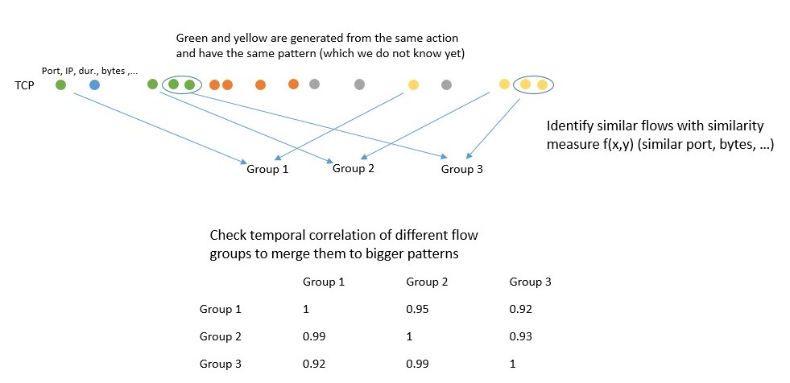
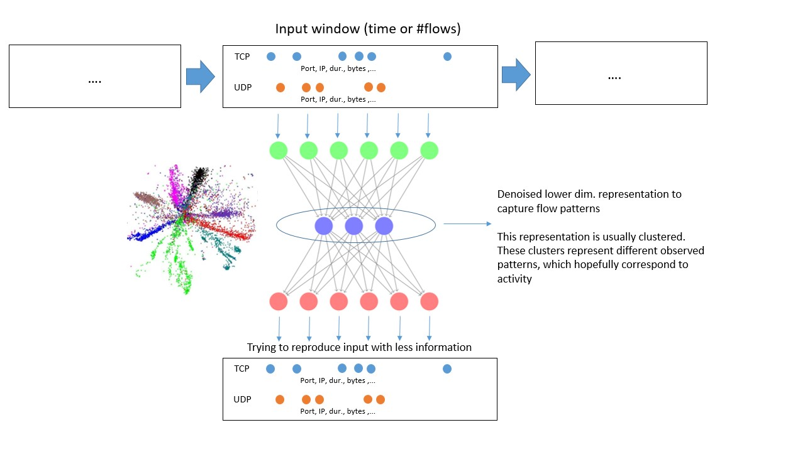
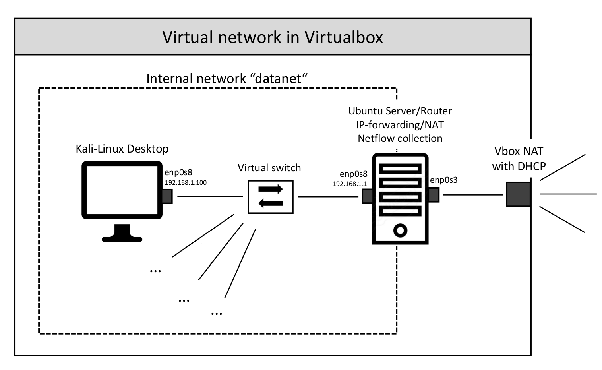

```{r setup, include=FALSE}
knitr::opts_chunk$set(echo = TRUE)
```


# What I did so far

+ Literature review

+ Thoughts on the aim of the project and early thoughts on methodology

+ Creating a virtual and reproducible network and early event data collection

+ Looking for Datasets


## Literature review summary

To summarise: There is plenty of literature of using Machine Learning, Statistics, or other data-centric and adaptive methods to spot malicious behaviour in network traffic. However, almost all of them come more from a network engineering and computer science background and focus on efficient and effective traffic processing and summarisation, and then use "Out-of-the-box"-machine learning or statistics methods without much adjustement or modification to fit the problem. These work reasonably well in order to quantify elements of attacks whose behaviour is already known, and there is no apparent need for sophisticated modeling procedures. When it comes to behavioural modeling of a network/host, I think the existing literature lacks depth and strategy to actually capture the behaviour in the necessary detail to spot anomalies without already assuming the more or less precise nature of the attack, and I believe more complex and detailed statistical/machine learning models are necessary to make use of the detail that is given through network traffic.

I identified these main strategies to approach netflow data:

+ Aggregation of flows over a time interval (1 minute and above) in order to to spot group anomalies of flows (i.e. the individual flows are not necessarily suspicious, but the occurrence as a group). These include:
    + volume anomalies (i.e. suspicious number of bytes, packets, or flows)
    + deviations in the number of contacted ports/IP addresses or individual connections, often via the entropy of their distribution
    + minimum, maximum, average, and standard deviation of these features
    + connection fail rates
    
    + The methods to detect anomalies in flow aggregation windows include 
        + PCA over a set number of windows, 
        + thresholding, 
        + SVMs and random forrest classifiers, 
        + Self-organizing maps (rather simple neural network technique for clustering), 
        + K-means clustering
+ Detecting individually suspicous flows by 
    + finger-printing the distribution of flows in the system by the number of packets, bytes, etc.
    	+ Techniques for this include simple clustering approaches to identify different types of flows using GMMs
    + looking at unusual connections/ports
    
    + A very interesting paper (Staniford et. al, 2002, "Practical automated detection of stealthy portscans") treats them as alerts and uses more sophisticated statistics methodology to correlate them over a longer temporal window
    
Furthermore, a very interesting paper talks about the current short-comings of anomaly detection in network intrusion detection (Sommer and Paxson, 2010, "Outside the Closed World: On Using Machine Learning For Network Intrusion Detection"). They criticise 5 main points:

+ The assumption that a model is capable of modeling every aspect of normality in a sufficient way (closed world assumption)
+ Current high false alert rates (not acceptable for an intrusion framework)
+ Lack of semantic gaps of the alert, i.e. network administrators have to be capable of understanding the alert and identifying false positives and real threats
+ Lack of data with ground truth to test and evaluate the model, too much reliance on synthetic data which in their eyes does not hold up to real world traffic
+ The abandoning of all knowledge about attacks  compared to classification based models


## Aim and Methodology

The broad scope of this project is to identify advanced and previously unseen attacks on a host system as anomalies from a behavioural model of the host system. As described above, there has been extensive research on attack detection via anomalies, also using behavioural approaches. However, the majority of the approaches did not use advanced models to capture a range of subtle behavioural aspects, but focused more on data preprocessing in ways which separate known attack-procedures from benign behaviour. Since we want to go further than this and step away from specific attack schemes, we want to focus on a more detailed and complex behavioural model of the network traffic a host machine produces and receives.

David has looked at modeling the semantic behaviour of a program in terms of actions and system-calls on a device before and found promising robustness against new and unseen attacks. Such a semantic approach could be used on network traffic too, but with a different methodology.

It is important to remember that network traffic is generated in a more or less bursty and time-constrained way from individual programm actions. It therefore takes different pattern sequences, depending on which action generated the traffic (such as a quick burst of port 53 UDP packets for DNS requests to a DNS server, a smaller number of TCP connections of moderate size on port 80 or 443 when going to a website, or one port 53 UDP packet exchange followed by a port 123 TCP connection for the time synchronisation of a device).

These patterns are then overlayed by other patterns from other actions, thus are in a noisy environment. However, when looking closely many of these patterns can still be identified.

If we can identify the patterns in a traffic stream, we can relate them back to the actions on the host system, and hopefully identify all the actions that occur on a host system and generate traffic. We can then identify anomalies as patterns that do not match any observed patterns or as patterns which occur too often or in an anomalous context (like sending out much more e-mails than usual etc.)


To develop a method to extract and characterize these patterns, I am currently looking at two possible methods, but my thoughts are still in an early stage:

+ Build a heuristic measure to quantify how similar individual flows are to each other (similar port, similar packet number, similar size, flags, connecting to outside traffic or internal network IP). We can move a small window (either in time or number of flows) across the traffic stream and put all flows inside this window into all possible groups. We then match these groups against groups we have seen before and estimate the similarity of the flows in the group with the constructed similarity measure. If multiple groups are close, we treat them as a re-occuring pattern, and estimate their statistical properties for easier comparison with future groups (since this way we only have to compare a group against the observed pattern instead of all groups that are similar, which would be computationally not feasible for longer streams). This approach has high similarities to alert correlation approaches like the one from Staniford et. al mentioned above. 

{ width=70% }


+ Unsupervised deep learning methods which spot re-occuring patterns through input reproduction. Among these are auto-encoders and restricted boltzmann machines. The deployment of such tools would depend on their exact nature, but the idea is to have groups of flows with their corresponding properties such as used ports, size, number of packets etc.  as the input. The algorithm is trained to reproduce the input (again, similarity measures are needed), but the hidden layers of the network compress the available information (auto-encoders just have less hidden nodes than input/output nodes, thus reduce the available information) in order to extract the underlying information that govern the pattern of the flows. The information encoded in the hidden layer can then be clustered in order to separate the different patterns and denoise the information. After training, we can spot observed patterns on the fly by looking at the information in the hidden layer and determining which pattern cluster they correspond to. We then have to measures to spot anomalies: Strong deviation in the input/output (corresponding to unobserved patterns which the algorithm is not trained to reproduce), and anomalies in the stream of identified patterns. This approach has significant similarities to approaches of *Non-Intrusive Energy Disaggregation* ("Neural NILM: Deep Neural Networks Applied to Energy Disaggregation", Kelly et al., 2015), where autoencoders are used to capture the energy consumption pattern of different devices in order to identify their use in the time-series of total energy consumption. 

 { width=70% }


An assumption David and I agreed is important and will make our live easier is to assume that the group of installed softwares on the host machines is static and known, i.e. new programms cannot be added. This way we do not have to model all possible patterns from any programm out there, but only for those that are in this group of installed programms. 

## Virtual Network and Data collection

If we want to look at network traffic on a more semantic basis and build tools to spot them, we need traffic data that can be related exactly to individual actions for two reasons:

+ To inform us how to design the tools and the included heuristic measures in order to capture such traffic patterns.
+ To validate whether the developed tools can actually identify patterns that correspond to actions on a host device or are just spotting nonsense.

The data we use for this should therefore be gathered in a reproducible and controlled environment. For this reason, I set up a virtual network with a router that connects the network with the internet and that collects the network traffic inside the network.

{ width=70% }

The Kali-Linux desktop does not emit any traffic on its own (except for ARP requests which are not observable in netflow). We can then proceed to conduct individual task on the computer and collect the corresponding traffic. David and I are talking about automatising this procedure in order to automatically gather the traffic.

Below is some example traffic that is collected for a specific task.

```{r Initial,eval=TRUE,cache=FALSE,echo=FALSE, results=FALSE}
setwd("~/Desktop/Project/Progress/Progress June 2018/")

Flows <- Outflows <- read.table("nf_data2.txt",sep=",",header=FALSE, stringsAsFactors = FALSE,skip=1,fill=TRUE)
del <- nrow(Flows)

Flows <- Flows <- read.table("nf_data2.txt",sep=",",header=FALSE, stringsAsFactors = FALSE,skip=1,nrows=del-4,fill=TRUE)
t11 <- sapply(strsplit(Flows[,1]," "), "[",2)
Flows[,1] <- c(data.matrix(read.table(text=t11,sep=":"))%*%c(3600,60,1))
Flows[,5] <- sapply(strsplit(Flows[,5],":"), "[",2)
Flows[,7] <- sapply(strsplit(Flows[,7],":"), "[",2)
Flows[,3] <- trimws(Flows[,3],which="both")
Flows[,4] <- trimws(Flows[,4],which="both")
Flows[,5] <- trimws(Flows[,5],which="both")
Flows[,6] <- trimws(Flows[,6],which="both")
Flows[,7] <- trimws(Flows[,7],which="both")
Flows[,9] <- trimws(Flows[,9],which="both")
Flows[,8] <- gsub(" M","000000",Flows[,8])
Flows[,9] <- gsub(" M","000000",Flows[,9])
Flows[,8] <- gsub(" G","000000000",Flows[,8])
Flows[,9] <- gsub(" G","000000000",Flows[,9])
Flows <- Flows[Flows[,5]!="123"&Flows[,7]!="123",]
colnames(Flows) <- c("timeStamp","duration","proto","srcip","srcport",
                              "destip","destport","packetcount","bytes","flowcount")
Flows <- Flows[order(Flows[,1]),]


Outflows <- Flows[Flows[,4]=="192.168.1.100",]
Inflows <- Flows[Flows[,6]=="192.168.1.100",]
Others <- Flows[Flows[,6]!="192.168.1.100"&Flows[,4]!="192.168.1.100",]

#dim(Inflows)
#dim(Outflows)


# Outflows <- Outflows[Outflows[,1]/3600>13.99,]
# Outflows[,1] <- Outflows[,1]-min(Outflows[,1])
# Inflows <- Inflows[Inflows[,1]/3600>13.99,]
# Inflows[,1] <- Inflows[,1]-min(Inflows[,1])


#Outflows ###############################################################

Outflows_b <- Outflows
Inflows_b <- Inflows

Outflows_b[,8] <- as.numeric(Outflows_b[,8])
Outflows_b[,9] <- as.numeric(Outflows_b[,9])
Inflows_b[,8] <- as.numeric(Inflows_b[,8])
Inflows_b[,9] <- as.numeric(Inflows_b[,9])

#Colors and groups
coldout <- rep("black",dim(Outflows)[1])
coldin <- rep("black",dim(Inflows)[1])
colpout <- rep("black",dim(Outflows)[1])
colpin <- rep("black",dim(Inflows)[1])
colbout <- rep("black",dim(Outflows)[1])
colbin <- rep("black",dim(Inflows)[1])

#quantile(as.numeric(Outflows[,2]),probs = c(0.7,0.95,0.99,0.999))
#quantile(as.numeric(Inflows[,2]),probs = c(0.7,0.95,0.99,0.999))
durationsv <- c(-1,0,1,10,100,600,Inf)
cold <- c("black","black","darkred","red","purple","green")

for(i in 2:length(durationsv)){
  Outflows[Outflows_b[,2]>durationsv[i-1]&Outflows_b[,2]<=durationsv[i],2] <- paste("<",durationsv[i])
  coldout[Outflows_b[,2]>durationsv[i-1]&Outflows_b[,2]<=durationsv[i]] <- cold[i-1]
  Inflows[Inflows_b[,2]>durationsv[i-1]&Inflows_b[,2]<=durationsv[i],2] <- paste("<",durationsv[i])
  coldin[Inflows_b[,2]>durationsv[i-1]&Inflows_b[,2]<=durationsv[i]] <- cold[i-1]
}

#quantile(as.numeric(Outflows[,8]),probs = c(0.7,0.95,0.99,0.999))
#quantile(as.numeric(Inflows[,8]),probs = c(0.7,0.95,0.99,0.999))
paketsv <- c(-1,1,10,100,1000,10000,100000,Inf)
colp <- c("black","black","darkred","red","purple","purple","green")

for(i in 2:length(paketsv)){
  Outflows[Outflows_b[,8]>paketsv[i-1]&Outflows_b[,8]<=paketsv[i],8] <- paste("<",paketsv[i])
  colpout[Outflows_b[,8]>paketsv[i-1]&Outflows_b[,8]<=paketsv[i]] <- colp[i-1]
  Inflows[Inflows_b[,8]>paketsv[i-1]&Inflows_b[,8]<=paketsv[i],8] <- paste("<",paketsv[i])
  colpin[Inflows_b[,8]>paketsv[i-1]&Inflows_b[,8]<=paketsv[i]] <- colp[i-1]
}

#quantile(as.numeric(Outflows[,9]),probs = c(0.7,0.95,0.99,0.999))
#quantile(as.numeric(Inflows[,9]),probs = c(0.7,0.95,0.99,0.999))
bytesv <- c(-1,100,10000,1000000,100000000,1000000000,Inf)
colb <- c("black","darkred","red","purple","purple","green")

for(i in 2:length(paketsv)){
  Outflows[Outflows_b[,9]>bytesv[i-1]&Outflows_b[,9]<=bytesv[i],9] <- paste("<",bytesv[i])
  colbout[Outflows_b[,9]>bytesv[i-1]&Outflows_b[,9]<=bytesv[i]] <- colb[i-1]
  Inflows[Inflows_b[,9]>bytesv[i-1]&Inflows_b[,9]<=bytesv[i],9] <- paste("<",bytesv[i])
  colbin[Inflows_b[,9]>bytesv[i-1]&Inflows_b[,9]<=bytesv[i]] <- colb[i-1]
}


library(RColorBrewer)
n <- 74
qual_col_pals = brewer.pal.info[brewer.pal.info$category == 'qual',]
col_vector = unlist(mapply(brewer.pal, qual_col_pals$maxcolors, rownames(qual_col_pals)))
#pie(rep(1,n), col=sample(col_vector, n))
```

```{r Data,eval=TRUE,cache=FALSE,fig.height=10,fig.width=15,echo=FALSE}
window <- c(0,10)+48705


yax <- seq(from = window[1], to = window[2], by = 5)

par(mfrow=c(1,2))


nout <- sum(table(Outflows[Outflows[,1]>=window[1]&Outflows[,1]<=window[2],6])>2)
nin <- sum(table(Inflows[Inflows[,1]>=window[1]&Inflows[,1]<=window[2],4])>2)

IPout <- names(sort(table(Outflows[Outflows[,1]>=window[1]&Outflows[,1]<=window[2],6]),decreasing = TRUE))
IPin <- names(sort(table(Inflows[Inflows[,1]>=window[1]&Inflows[,1]<=window[2],4]),decreasing = TRUE))

colsout <- rep("black",length(Outflows[Outflows[,1]>=window[1]&Outflows[,1]<=window[2],6]))
colsin <- rep("black",length(Inflows[Inflows[,1]>=window[1]&Inflows[,1]<=window[2],6]))

for(i in 1:nout){
  colsout[Outflows[Outflows[,1]>=window[1]&Outflows[,1]<=window[2],6]==IPout[i]]=col_vector[i]
}

for(i in 1:nin){
  colsin[Inflows[Inflows[,1]>=window[1]&Inflows[,1]<=window[2],4]==IPin[i]]=col_vector[i]
}

outUDP <- Outflows[Outflows[,1]>=window[1]&Outflows[,1]<=window[2],3]=="UDP"
outTCP <- Outflows[Outflows[,1]>=window[1]&Outflows[,1]<=window[2],3]=="TCP"
inUDP <- Inflows[Inflows[,1]>=window[1]&Inflows[,1]<=window[2],3]=="UDP"
inTCP <- Inflows[Inflows[,1]>=window[1]&Inflows[,1]<=window[2],3]=="TCP"


#sort(table(Outflows[Outflows[,1]>=window[1]&Outflows[,1]<=window[2],6]),decreasing = TRUE)
#sort(table(Inflows[Inflows[,1]>=window[1]&Inflows[,1]<=window[2],4]),decreasing = TRUE)

#Outflows ##################

plot(Outflows[Outflows[,3]=="UDP"&Outflows[,1]>=window[1]&Outflows[,1]<=window[2],1]*0,Outflows[Outflows[,3]=="UDP"&Outflows[,1]>=window[1]&Outflows[,1]<=window[2],1],
     col=colsout[outUDP],ylim=rev(window),pch=16,cex=0.8,xlim=c(-0.6,0.5),axes=FALSE,frame.plot=TRUE,
     main="Outflows: Going to bbc.co.uk",ylab=" " ,xlab=" ")
axis(side = 2, at = yax)
points(Outflows[Outflows[,3]=="TCP"&Outflows[,1]>=window[1]&Outflows[,1]<=window[2],1]*0-0.5,Outflows[Outflows[,3]=="TCP"&Outflows[,1]>=window[1]&Outflows[,1]<=window[2],1],
       col=colsout[outTCP],cex=0.8,pch=16)

abline(v=-0.025,lty=2)
text(-0.3,48705,labels="TCP",cex=1.5)
text(0.2,48705,labels="UDP",cex=1.5)

text(-0.43,48705.8,labels="Port",cex=0.8)
text(0.067,48705.8,labels="Port",cex=0.8)

text(-0.33,48705.8,labels="Dur.",cex=0.8)
text(0.167,48705.8,labels="Dur.",cex=0.8)

text(-0.2,48705.8,labels="Bytes",cex=0.8)
text(0.3,48705.8,labels="Bytes",cex=0.8)

text(-0.09,48705.8,labels="Packets",cex=0.8)
text(0.41,48705.8,labels="Packets",cex=0.8)

#Ports
text(Outflows[Outflows[,3]=="UDP"&Outflows[,1]>=window[1]&Outflows[,1]<=window[2],1]*0+0.07, Outflows[Outflows[,3]=="UDP"&Outflows[,1]>=window[1]&Outflows[,1]<=window[2],1],
     labels = Outflows[Outflows[,3]=="UDP"&Outflows[,1]>=window[1]&Outflows[,1]<=window[2],7],offset = 0, cex = 0.7)
text(Outflows[Outflows[,3]=="TCP"&Outflows[,1]>=window[1]&Outflows[,1]<=window[2],1]*0-0.43, Outflows[Outflows[,3]=="TCP"&Outflows[,1]>=window[1]&Outflows[,1]<=window[2],1],
     labels = Outflows[Outflows[,3]=="TCP"&Outflows[,1]>=window[1]&Outflows[,1]<=window[2],7],offset = 0, cex = 0.7)

#Duration

text(Outflows[Outflows[,3]=="UDP"&Outflows[,1]>=window[1]&Outflows[,1]<=window[2],1]*0+0.16, Outflows[Outflows[,3]=="UDP"&Outflows[,1]>=window[1]&Outflows[,1]<=window[2],1],
     labels = Outflows[Outflows[,3]=="UDP"&Outflows[,1]>=window[1]&Outflows[,1]<=window[2],2],offset = 0, cex = 0.7,col=coldout[Outflows[,3]=="UDP"&Outflows[,1]>=window[1]&Outflows[,1]<=window[2]])
text(Outflows[Outflows[,3]=="TCP"&Outflows[,1]>=window[1]&Outflows[,1]<=window[2],1]*0-0.34, Outflows[Outflows[,3]=="TCP"&Outflows[,1]>=window[1]&Outflows[,1]<=window[2],1],
     labels = Outflows[Outflows[,3]=="TCP"&Outflows[,1]>=window[1]&Outflows[,1]<=window[2],2],offset = 0, cex = 0.7,col=coldout[Outflows[,3]=="TCP"&Outflows[,1]>=window[1]&Outflows[,1]<=window[2]])

#Bytes

text(Outflows[Outflows[,3]=="UDP"&Outflows[,1]>=window[1]&Outflows[,1]<=window[2],1]*0+0.3, Outflows[Outflows[,3]=="UDP"&Outflows[,1]>=window[1]&Outflows[,1]<=window[2],1],
     labels = Outflows[Outflows[,3]=="UDP"&Outflows[,1]>=window[1]&Outflows[,1]<=window[2],9],offset = 0, cex = 0.7,col=colbout[Outflows[,3]=="UDP"&Outflows[,1]>=window[1]&Outflows[,1]<=window[2]])
text(Outflows[Outflows[,3]=="TCP"&Outflows[,1]>=window[1]&Outflows[,1]<=window[2],1]*0-0.2, Outflows[Outflows[,3]=="TCP"&Outflows[,1]>=window[1]&Outflows[,1]<=window[2],1],
     labels = Outflows[Outflows[,3]=="TCP"&Outflows[,1]>=window[1]&Outflows[,1]<=window[2],9],offset = 0, cex = 0.7,col=colbout[Outflows[,3]=="TCP"&Outflows[,1]>=window[1]&Outflows[,1]<=window[2]])

#Pakets

text(Outflows[Outflows[,3]=="UDP"&Outflows[,1]>=window[1]&Outflows[,1]<=window[2],1]*0+0.4, Outflows[Outflows[,3]=="UDP"&Outflows[,1]>=window[1]&Outflows[,1]<=window[2],1],
     labels = Outflows[Outflows[,3]=="UDP"&Outflows[,1]>=window[1]&Outflows[,1]<=window[2],8],offset = 0, cex = 0.7,col=colpout[Outflows[,3]=="UDP"&Outflows[,1]>=window[1]&Outflows[,1]<=window[2]])
text(Outflows[Outflows[,3]=="TCP"&Outflows[,1]>=window[1]&Outflows[,1]<=window[2],1]*0-0.1, Outflows[Outflows[,3]=="TCP"&Outflows[,1]>=window[1]&Outflows[,1]<=window[2],1],
     labels = Outflows[Outflows[,3]=="TCP"&Outflows[,1]>=window[1]&Outflows[,1]<=window[2],8],offset = 0, cex = 0.7,col=colpout[Outflows[,3]=="TCP"&Outflows[,1]>=window[1]&Outflows[,1]<=window[2]])

#Inflows ##################

plot(Inflows[Inflows[,3]=="UDP"&Inflows[,1]>=window[1]&Inflows[,1]<=window[2],1]*0,Inflows[Inflows[,3]=="UDP"&Inflows[,1]>=window[1]&Inflows[,1]<=window[2],1],
     col=colsin[inUDP],ylim=rev(window),pch=16,cex=0.8,xlim=c(-0.6,0.5),axes=FALSE,frame.plot=TRUE,
     main="Inflows: Going to bbc.co.uk",ylab=" " ,xlab=" ")
axis(side = 2, at = yax)
points(Inflows[Inflows[,3]=="TCP"&Inflows[,1]>=window[1]&Inflows[,1]<=window[2],1]*0-0.5,Inflows[Inflows[,3]=="TCP"&Inflows[,1]>=window[1]&Inflows[,1]<=window[2],1],
       col=colsin[inTCP],cex=0.8,pch=16)

abline(v=-0.025,lty=2)
text(-0.3,48705,labels="TCP",cex=1.5)
text(0.2,48705,labels="UDP",cex=1.5)

text(-0.43,48705.8,labels="Port",cex=0.8)
text(0.067,48705.8,labels="Port",cex=0.8)

text(-0.33,48705.8,labels="Dur.",cex=0.8)
text(0.167,48705.8,labels="Dur.",cex=0.8)

text(-0.2,48705.8,labels="Bytes",cex=0.8)
text(0.3,48705.8,labels="Bytes",cex=0.8)

text(-0.09,48705.8,labels="Packets",cex=0.8)
text(0.41,48705.8,labels="Packets",cex=0.8)


#Ports
text(Inflows[Inflows[,3]=="UDP"&Inflows[,1]>=window[1]&Inflows[,1]<=window[2],1]*0+0.07, Inflows[Inflows[,3]=="UDP"&Inflows[,1]>=window[1]&Inflows[,1]<=window[2],1],
     labels = Inflows[Inflows[,3]=="UDP"&Inflows[,1]>=window[1]&Inflows[,1]<=window[2],5],offset = 0, cex = 0.7)
text(Inflows[Inflows[,3]=="TCP"&Inflows[,1]>=window[1]&Inflows[,1]<=window[2],1]*0-0.43, Inflows[Inflows[,3]=="TCP"&Inflows[,1]>=window[1]&Inflows[,1]<=window[2],1],
     labels = Inflows[Inflows[,3]=="TCP"&Inflows[,1]>=window[1]&Inflows[,1]<=window[2],5],offset = 0, cex = 0.7)

#Duration

text(Inflows[Inflows[,3]=="UDP"&Inflows[,1]>=window[1]&Inflows[,1]<=window[2],1]*0+0.16, Inflows[Inflows[,3]=="UDP"&Inflows[,1]>=window[1]&Inflows[,1]<=window[2],1],
     labels = Inflows[Inflows[,3]=="UDP"&Inflows[,1]>=window[1]&Inflows[,1]<=window[2],2],offset = 0, cex = 0.7,col=coldin[Inflows[,3]=="UDP"&Inflows[,1]>=window[1]&Inflows[,1]<=window[2]])
text(Inflows[Inflows[,3]=="TCP"&Inflows[,1]>=window[1]&Inflows[,1]<=window[2],1]*0-0.34, Inflows[Inflows[,3]=="TCP"&Inflows[,1]>=window[1]&Inflows[,1]<=window[2],1],
     labels = Inflows[Inflows[,3]=="TCP"&Inflows[,1]>=window[1]&Inflows[,1]<=window[2],2],offset = 0, cex = 0.7,col=coldin[Inflows[,3]=="TCP"&Inflows[,1]>=window[1]&Inflows[,1]<=window[2]])

#Bytes

text(Inflows[Inflows[,3]=="UDP"&Inflows[,1]>=window[1]&Inflows[,1]<=window[2],1]*0+0.3, Inflows[Inflows[,3]=="UDP"&Inflows[,1]>=window[1]&Inflows[,1]<=window[2],1],
     labels = Inflows[Inflows[,3]=="UDP"&Inflows[,1]>=window[1]&Inflows[,1]<=window[2],9],offset = 0, cex = 0.7,col=colbin[Inflows[,3]=="UDP"&Inflows[,1]>=window[1]&Inflows[,1]<=window[2]])
text(Inflows[Inflows[,3]=="TCP"&Inflows[,1]>=window[1]&Inflows[,1]<=window[2],1]*0-0.2, Inflows[Inflows[,3]=="TCP"&Inflows[,1]>=window[1]&Inflows[,1]<=window[2],1],
     labels = Inflows[Inflows[,3]=="TCP"&Inflows[,1]>=window[1]&Inflows[,1]<=window[2],9],offset = 0, cex = 0.7,col=colbin[Inflows[,3]=="TCP"&Inflows[,1]>=window[1]&Inflows[,1]<=window[2]])

#Pakets

text(Inflows[Inflows[,3]=="UDP"&Inflows[,1]>=window[1]&Inflows[,1]<=window[2],1]*0+0.4, Inflows[Inflows[,3]=="UDP"&Inflows[,1]>=window[1]&Inflows[,1]<=window[2],1],
     labels = Inflows[Inflows[,3]=="UDP"&Inflows[,1]>=window[1]&Inflows[,1]<=window[2],8],offset = 0, cex = 0.7,col=colpin[Inflows[,3]=="UDP"&Inflows[,1]>=window[1]&Inflows[,1]<=window[2]])
text(Inflows[Inflows[,3]=="TCP"&Inflows[,1]>=window[1]&Inflows[,1]<=window[2],1]*0-0.1, Inflows[Inflows[,3]=="TCP"&Inflows[,1]>=window[1]&Inflows[,1]<=window[2],1],
     labels = Inflows[Inflows[,3]=="TCP"&Inflows[,1]>=window[1]&Inflows[,1]<=window[2],8],offset = 0, cex = 0.7,col=colpin[Inflows[,3]=="TCP"&Inflows[,1]>=window[1]&Inflows[,1]<=window[2]])

```
## Useful Datasets

* LANL - Unified Host and Network Dataset
	* subset of network and computer (host) events collected from the Los Alamos National Laboratory enterprise network over the course of approximately 90 days
* ADFA-LD12
	*  representative of the modern attack structure and methodology
	*  Ubuntu as host system, software with known vulnerabilities installed for penetration testing and web-attacks
*  PREDICT
	* puts out regularly updated network data 
* CAIDA
	* Provides basic unlabeled captured network traces 
* DEFCON
	*  consists mainly of intrusive traffic 
	*  used for alert correlation technique.
* KYOTO
	* Contains traffic from honeypots of Kyoto University
* ISCX 2012
	* seven days captured traffic with overall 2450324 flows including DoS attacks