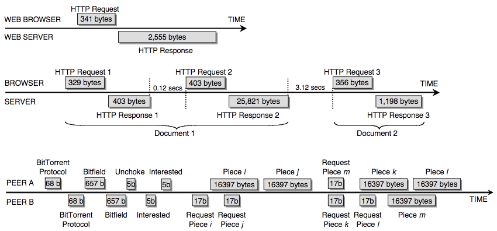

```{r setup, include=FALSE}
knitr::opts_chunk$set(echo = TRUE)
```


### Current thoughts on modeling approach

My current focus lies on the analysis and grouping of traffic connections/flows. Connections/flows are itself closed entities in network traffic that give traffic, i.e. they act as atomic units of which traffic consists. 

Connections can obviously be produced by different applications, and these often transmit data with (a finite set of) different connection protocols/implementations. This notion of protocol/implementation is finer than the one of usual traffic protocols such as http or ssh.

- Assumption: These different implementations leave different observable patterns in the connection that differentiate them from other implementations, but are consistent in one implementation. This assumption is backed by several papers that describe different patterns within connections.
{ width=70% }
*Understanding Patterns of TCP Connection Usage with Statistical Clustering (2005), Hernandez-Campos et. al*
	
- Aim: Discover different patterns in the observed connections in unsupervised manner to feed a model that classifies connections as members of different pattern groups. This means that we build a model that transforms the manifestion of implementation patterns into a set of features that can represent these patterns, and then converges connections with similar features into groups. This process could potentially be supported by a small set of labeled connections from different implementations to have initial groups that would ease the convergence in a semi-supervised manner.

Having a model that can identify the different connection implementations in a relatively closed computer network gives us important benefits:

1. We can identify the occurrence of implementations previously unobserved present in the traffic which might correspond a new program generating traffic, i.e. a possible intrusion
2. We can with relatively low effort build a model that describes the frequency of occurrence of different implementation on different hosts and possibly correlate the temporal occurrency of different implementations to each other, thus building a behavioural model of  
3. We investigate which protocols necessarily or can follow each other (possibly in the form of finite state automata), thus creating a semantic model of how program traffic behaviour looks like
		
Of course, the identified pattern groups should actually correspond to different application protocols/implementations for the model to have a real-world meaning. Therefore, whether the model really groups connections according to implementations needs to be validated, i.e. we need to investigate:

1. How well the model is able to differentiate between actual implementations/protols
2. How consistently the model puts connections from the same implementation/protocol into the same group
			
This validation is in my eyes the main purpose of Nikola's project: We want to generate isolated connection data from different protocols/implementations that we can savely match to the corresponding connection implementations.
	
	
###Technical aspects/thoughts:	

There have been several papers concerning the grouping/fingerprinting of connections, especially TCP connections. They either wanted to identify programs from their traffic, or discover existing underlying structures in network traffic (more like us). This is done either via supervised learning using data generated from a gathered set of applications (like on Android), or via clustering (all clustering tehniques I found used GMM or K-Means in a straightforward manner on the features). The problem for us with supervised methods is that I do no believe we can actually gather or generate a dataset from labeled programs that represents actual network traffic, and even if, this does not mean that this can be repeated for other computer networks. Without this generalisation, we won't be able to identify all occuring patterns (which is necessary for anomaly detection). Therefore, an unsupervised approach should be used that is automatically identifying occuring patterns.

Multiple approaches up to now use standard flow features(#packets, #bytes, duration), in my opinion a poor characterisation of a connection. Others used more interesting features, predominantly statistical features on the #bytes, #packets, and interarrival times like standard deviation, maximum, etc. Another approach that occured multiple times is to look at the way the data is transmitted, i.e. to distuingish between transaction mode where packets are sent back and forth equally, bulk mode where multiple consecutive packets are sent in one direction, and idle mode during which no packets are sent for at least x seconds. 

My current feature generator collects statistics on the number, bytes, and interarrivals of incoming and outgoing packets, record how many of each different transfer modes occur in the connection along with statistics on the packets in them, and records the first x modes with their corresponding packet statistics. Another interesting approach to look at is how the connection reacts to lost packets, but I did not look at that yet.


Since there are now many features, many of whom are correlated, and we have a sequential structure of the first x transfer modes, the data is not suitable for standard clustering algorithms. Therefore, the preprocessing with an autoencoder is sensible. A denoising autoencoder can pick up different complex patterns such as which transfer modes follow each other, and condense these patterns in lower dimenstions where it groups them apart from each other. We can then apply standard clustering algorithms on this lower dimensional space and extract observed groups.

#### Nikola's project

I see Nikola's project as a tool that gives us representations of connection protocols/implementations. These can be used to investigate how connection patters manifest themselves, how they differ across different protocols/implementations, and to validate a model that identifies their patterns. 

Plans what to do right now:

- Test internal validity of project, i.e. the exact same action does not depend on the machine it is executed on
  - This can be done by feeding the captured traffic through the already implemented feature generation tool and see if any differenes are apparent

- Test how consistent patterns are for similar actions using the same implementation:
  - Generate a number of captures from each containerized application
    - Ideally, the data transmitted is randomized, for instance this can be done for mailx, ftp, syncthing by generating txt-files with random length that should be transferred.
  - For each application, analyse the different number of connections generated (this number should be constant for each containerised application script, even with randomized file lengths)
  - Feed the generated features into a simple classifier to test validity of framework and to further investigate which features are important

In the long run, feed the data into an unsupervised framework as described above to test if the labels can be reconstructed by itself.
