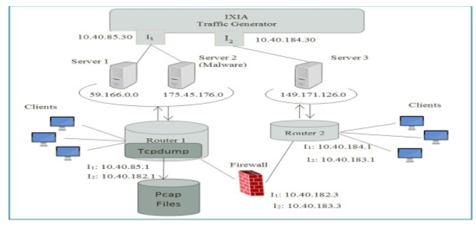

# Public Datasets

A collection of links to pubished datasets with some remarks for Detgen.

### Impact Cyber Trust

[Impact Cyber Trust](https://www.impactcybertrust.org/) cyber security oriented data, includes many data sets, synthetic as well as real captures, from different sources. Many datasets focus on observed attack data, are not directly relevant to the project. In general, there is very little information given that describe the datasets origin, which makes it hard to investigate how relevant or biased the data is.

* [Packet headers](https://www.impactcybertrust.org/search?filter[]=Topic%3A+Network+Data+%3A+IP+Packet+Headers)
  * [USC DS-062 Data](https://www.impactcybertrust.org/dataset_view?idDataset=62), DOI:10.23721/109/1353578
  		* One hour, 2008, anonymized packet headers from University of Southern California, 66 GB
    	* Relevant, but a bit old
  * [USC LANDER Data](https://www.impactcybertrust.org/dataset_view?idDataset=75), DOI:10.23721/109/1353591
    	* 48 hour, 2008, anonymized packet headers from academic ISP, 357 GB
    	* Relevant, but a bit old
  * [CAIDA UCSD OC48 Peering Point Traces](https://www.impactcybertrust.org/dataset_view?idDataset=833), DOI:10.23721/107/1421849
    	* IP headers from a large ISP in USA from 2003, 8.6 GB
    	* Looks like it is very sparse traffic and very unstructured (was collected between 2003 and 2003, only 8 GB?)
    	* Less relevant I think
  

* [Traffic Flow Data](https://www.impactcybertrust.org/search?filter[]=Topic%3A+Network+Data+%3A+Traffic+Flow+Data)
  * [USC DS-266](https://www.impactcybertrust.org/dataset_view?idDataset=265) and [USC DS-264](https://www.impactcybertrust.org/dataset_view?idDataset=264), DOI: 10.23721/109/1353780 and 10.23721/109/1353779
    	* 2010, two weeks of IP Flows 
    	* Supposedly from the USC academic network, but no information given about the origin of the flows

### Los Alamos Data

Server down currently

#### [UGR'16](https://nesg.ugr.es/nesg-ugr16/index.php): A New Dataset for the Evaluation of Cyclostationarity-Based Network IDSs

* 4 months of netflow data from a spanish 3-tier ISP
	* the network is used by many client companies --> implies that the traffic traversing the network is traffic very heterogeneous
* 5 attack machines, 20 victim machines
	*  inject the traffic in the dataset as if all the
twenty victim machines in our setup are infected
* labelled attack flows
* about 14GB per week background traffic

#### [UNSW-NB15](https://www.unsw.adfa.edu.au/unsw-canberra-cyber/cybersecurity/ADFA-NB15-Datasets/): A Comprehensive Data set for Network Intrusion Detection systems
* DOI: 10.1109/MilCIS.2015.7348942
* consists of real world traffic from a network (Cyber Range Lab of the Australian Centre for Cyber Security) and synthetic contemporary attack behaviours using IXIA PerfectStorm tool
	* Attacks: Fuzzers, Analysis, Backdoors, DoS, Exploits, Generic, Reconnaissance, Shellcode and Worms

<!--{ width=70% }-->

* 100 GB of the raw traffic (pcap from TCPdump), also used Bro and Argus to generate 49 features with the class label
* 16 hours on Jan 22, 2015 and 15  hours  on  Feb  17,  2015

#### Canadian Institute for Cyber-Sec, UNB
##### Intrusion Detection Evaluation Dataset, [CIC IDS2017](http://www.unb.ca/cic/datasets/ids-2017.html)

* 5 days of traffic from 12 computers (Windows, Ubuntu, Mac, all with different OS versions)
	* Only one day with purely benign activity
	* Various attacks carried out (Hear-bleed, Scan, DoS, Brute-force)
	* complete network topology 
* Flows as well as Pcap files available with packet payloads
* approx. 11 GB per day
* labelled attack data
* Similar dataset [ISCXIDS2012](http://www.unb.ca/cic/datasets/ids.html) from 2010

* It would also be worth looking at the [Botnet dataset](http://www.unb.ca/cic/datasets/botnet.html), however it does not contain clean benign data as far as I understood 

<!--#### IoT-->

##### Sperotto, 2008
DOI:10.1007/978-3-642-04968-2_4
* Honeypot running services in a university network
* Does not like like it might represent actual network traffic

#### [MAWILab](http://www.fukuda-lab.org/mawilab/data.html)
* daily traces of 15 minutes captured in a link between Japan and the United States --> very diverse traffic
*  labels are generated by using a combination of several
anomaly detection classifiers
* from 2001-2010, labelled since 2007
* pcap files
  

## Application Testing Frameworks

I have not found any specific datasets concerning the variety of traffic from individual applications, but there are several tools out there for automated web application testing, the most popular probably being [*Selenium*](https://www.seleniumhq.org/). I also found a post about the automated traffic capture of web applications using Selenium in this [blog](https://saucelabs.com/blog/capture-network-traffic-with-automation-scripts).