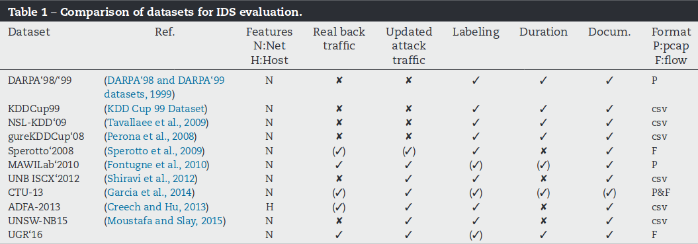

# Public Datasets

A collection of links to pubished datasets with some remarks for Detgen.

{ width=70% }

### Impact Cyber Trust

[Impact Cyber Trust](https://www.impactcybertrust.org/) cyber security oriented data, includes many data sets, synthetic as well as real captures, from different sources. Many datasets focus on observed attack data, are not directly relevant to the project. In general, there is very little information given that describe the datasets origin, which makes it hard to investigate how relevant or biased the data is.

* [Packet headers](https://www.impactcybertrust.org/search?filter[]=Topic%3A+Network+Data+%3A+IP+Packet+Headers)
  
  * [USC DS-062 Data](https://www.impactcybertrust.org/dataset_view?idDataset=62), DOI:10.23721/109/1353578
    * One hour, 2008, anonymized packet headers from University of Southern California, 66 GB
    * Relevant, but a bit old
    
  * [USC LANDER Data](https://www.impactcybertrust.org/dataset_view?idDataset=75), DOI:10.23721/109/1353591
    * 48 hour, 2008, anonymized packet headers from academic ISP, 357 GB
    * Relevant, but a bit old
  
  * [CAIDA UCSD OC48 Peering Point Traces](https://www.impactcybertrust.org/dataset_view?idDataset=833), DOI:10.23721/107/1421849
    * IP headers from a large ISP in USA from 2003, 8.6 GB
    * Looks like it is very sparse traffic and very unstructured (was collected between 2003 and 2003, only 8 GB?)
    * Less relevant I think
  

* [Traffic Flow Data](https://www.impactcybertrust.org/search?filter[]=Topic%3A+Network+Data+%3A+Traffic+Flow+Data)

  * [USC DS-266](https://www.impactcybertrust.org/dataset_view?idDataset=265) and [USC DS-264](https://www.impactcybertrust.org/dataset_view?idDataset=264), DOI: 10.23721/109/1353780 and 10.23721/109/1353779
    * 2010, two weeks of IP Flows 
    * Supposedly from the USC academic network, but no information given about the origin of the flows

### Los Alamos Data

Server down currently

#### IoT

#### [UGR'16](https://nesg.ugr.es/nesg-ugr16/index.php): A New Dataset for the Evaluation of Cyclostationarity-Based Network IDSs

* 4 months of netflow data from a 

#### [UNSW-NB15](https://www.unsw.adfa.edu.au/unsw-canberra-cyber/cybersecurity/ADFA-NB15-Datasets/): A Comprehensive Data set for Network Intrusion Detection systems
* DOI: 10.1109/MilCIS.2015.7348942
* consists of real world traffic from a network (Cyber Range Lab of the Australian Centre for Cyber Security) and synthetic contemporary attack behaviours using IXIA PerfectStorm tool
	* Attacks: Fuzzers, Analysis, Backdoors, DoS, Exploits, Generic, Reconnaissance, Shellcode and Worms

{ width=70% }

* 100 GB of the raw traffic (pcap from TCPdump), also used Bro and Argus to generate 49 features with the class label
* 16 hours on Jan 22, 2015 and 15  hours  on  Feb  17,  2015

### Data-Sets:

	* ADFA-LD12
		*  representative of the modern attack structure and methodology
		*  Ubuntu as host system, software with known vulnerabilities installed for penetration testing and web-attacks
	*  PREDICT
		* puts out regularly updated network data 
	* CAIDA
		* Provides basic unlabeled captured network traces 
	* DEFCON
		*  consists mainly of intrusive traffic 
		*  used for alert correlation technique.
	* KYOTO
		* Contains traffic from honeypots of Kyoto University
	* ISCX 2012
		* seven days captured traffic with overall 2450324 flows including DoS attacks
