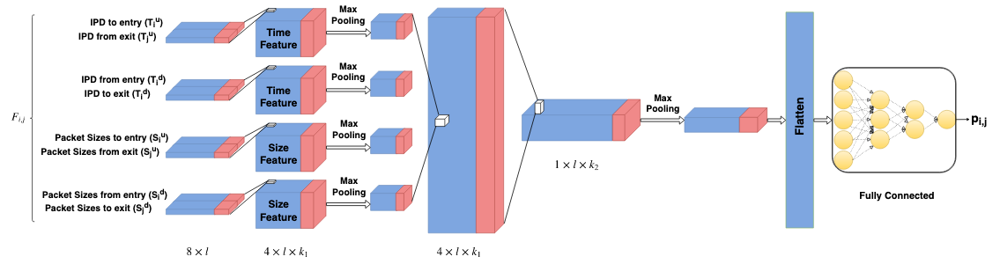

## Stepping stone project - Current state

#### 1. The interactive stepping stone detection problem

Stepping stones are proxies used to relay network traffic for malicious purposes. They can be used to disguise the attackers origin, or to connect/attack restricted-area devices from a intermediate computer with access privilege.

*Example of a stepping-stone chain with three intermediate hosts*

Apart from watermarking, which is an active pertubation technique, stepping stone detection methods can normally be distinguished between correlation-based techniques, and the statistical quantification of connection chain lengths in a network.

Correlation-based techniques assume that a detector sits on or at a host machine to determine if this host is used as a stepping stone. For that, simultaneously active connection pairs are examined for correlation between the packets sent in each connection to determine if the connections are part of a stepping-stone chain.
 

According to most literature in the field, evasion tactics for connection correlation consists of adding independent random chaff packets to the connections, and in adding jitter delays when forwarding of packets.

#### 2. Data generation

As it seems that there is no publicly available data on stepping stones, I implemented a interactive ssh stepping-stone scenario using ssh-tunnels in our docker framework. This scenario consists of three hosts A, B, and C, with B acting as the intermediate stepping stone that is relaying ssh-traffic from A to C. 

For that, A initiates a ssh-tunnel to B that forwards a set of ports. Similarly, B initiates a ssh-tunnel to C that forwards the same ports. Traffic directed to these ports on host A is now transferred through the tunnels to the corresponding ports on host C. 

The connections between A/B and B/C are now the stepping stone connection pair of interest, between which correlation is to be detected.

*image to be inserted, likely still on BT computer*

##### Chaff and jitter

In addition to this, chaff packets and jitter delays are added to the connections, using netcat and netem. The chaff packets inserted in connection A/B are independent of those inserted in connection B/C, and are filtered out when arriving at host B, therefore not forwarded from A/B to B/C or vice versa. Delays are added by adding random delays to all packets leaving host B. 

The amount of chaff packets inserted follows a statistical (Cauchy) distribution and is regulated by an independent parameter for each connection. The amount of delays is drawn from regulated by a parameter.
 
##### Interactive ssh traffic

The traffic that is relayed from A via B to C at the moment consists of ssh traffic. For that, a script is compiled at random from a set of ssh commands and several sleep commands when starting the scenario, and then executed on A. This is to make the transmitted traffic more heterogenic instead of repeating the same thing in every generated connection pair.

##### Data generation

Similar to the ssh-script, the chaff/delay parameters are drawn at random when starting the stepping stone scenario to cover a range of stepping stone settings. The generated parameter values are collected in a separate file.

In total, I executed the described scenario 10,000 times and collected the traffic for the tunnel connection A/B and B/C. The recording starts with a delay so that chaff and delays are already in place and to avoid having distinct fingerprints in the data from the initiation of the ssh-tunnels.

To create data that represents benign traffic, I use the same scenario as above, but with the ssh-traffic in the two connections being independent. By using the same scenario with chaff and delays, it should be a more difficult task to distinguish between stepping-stone pairs and benign pairs, as no simple fingerprints can be learned.

The collected packets are then parsed as rows in a table, along with the corresponding parameters. Each row now corresponds to a datapoint. 

#### 3. Detection model

The implemented detection model follows losely a model called DeepCorr, developed to correlate connections in Tor-connections, to which I made a few adjustements. I believe that for larger datasets, a composite model might be most appropriate, but so far I only tested my implementation of DeepCorr.

*Depiction of the layers in DeepCorr*

The detection model takes the first N (in this case 300) packets of connection A/B and from connection B/C, extracts the upstream and downstream packet sizes and interarrival times, and parses them as four 2d arrays to the model, with the two channels in each array corresponding to connection A/B and B/C. The model then slides a set of *filters* or *kernels* over a window of packets for each of the four arrays to identify low-level features/correlation, before the same is done at a higher level.

So far, the results seem promising since the model quickly learns to distinguish between stepping-stone pairs and benign pairs. However, I could not analyse the results yet due to GPU server downtime this week (it ended today).

