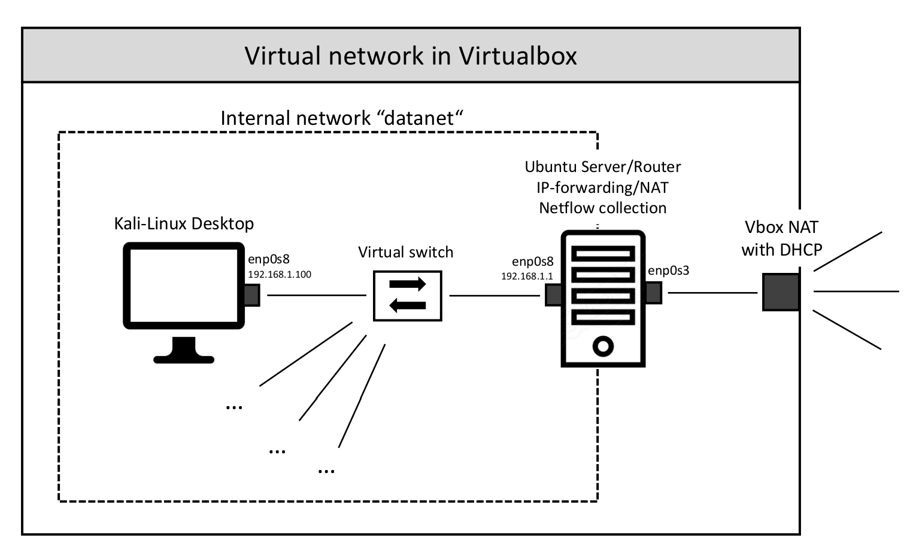
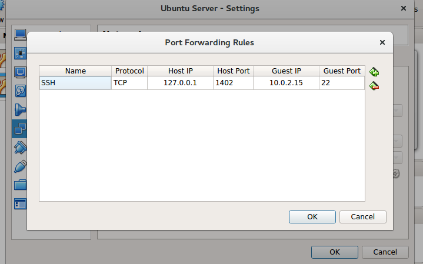

```{r setup, include=FALSE}
knitr::opts_chunk$set(echo = TRUE)
```


## Design

{ width=70% }


## Installation files:

- Ubuntu 18.04 Desktop iso
- Ubuntu 16.04 Server iso


## SSH to VBox

- In port forwarding, set the following rule for the corresponding local ip address of the V-machine:

{ width=50% }


#### Configure Desktop

- Install the Vrtual machine with
  - enough CPU (2 kernels), 
  - enough memory (4 GB), 
  - 20GB harddrive, 
  - Network adapter 1 with NAT and port forwarding as above with port 1401
  - Network adapter 2 with internal network named "datanet"
  
- Install in basic version (username henry)
- After installation, do the following in bash:

```{bash guest edition, eval=FALSE}
sudo apt-get update
sudo apt-get install openssh-server
sudo apt install net-tools

sudo apt install linux-headers-$(uname -r) build-essential dkms
```

+ Insert guest edition and run
- Use SSH now:
```{bash ssh rule, eval=FALSE}
ssh -p 1402 henry@127.0.0.1
```

- If a cloned machine has already been connected on the host, the VM identy has to be updated in ssh log:

```{bash ssh rule 2, eval=FALSE}
ssh-keygen -f "/home/henry/.ssh/known_hosts" -R [127.0.0.1]:1401
```

+ Now configure internal network

```{bash configure desktop, eval=FALSE}
sudo nano /etc/netplan/01-netcfg.yaml
```
Insert:
```{bash configure desktop2, eval=FALSE}
# This file describes the network interfaces available on your system
# For more information, see netplan(5).
network:
  version: 2
  renderer: networkd
  ethernets:
    enp0s8:
      dhcp4: no
      dhcp6: no
      addresses: [192.168.1.100/24, '2001:1::1/64']
      gateway4: 192.168.1.1
      nameservers:
        addresses: [8.8.8.8,8.8.4.4]
```
Now do
```{bash configure desktop3, eval=FALSE}
sudo netplan apply
```

- Now remove network adapter 1, the machine is now only connected to internal network.

For Kali-Linux:

```{bash configure desktop4, eval=FALSE}
sudo apt update & apt -y dist-upgrade
reboot
apt -y install virtualbox-guest-x11
reboot

sudo nano /etc/network/interfaces

# The primary network interface
auto eth0
iface eth0 inet static
    address 192.168.1.100
    netmask 255.255.255.0
    broadcast 192.168.1.255
    gateway 192.168.1.1
    dns-nameservers 8.8.8.8

/etc/init.d/networking restart
```


#### Configure Router

- Install the VM with
  - moderate CPU (1 kernel), 
  - moderate memory (2 GB), 
  - 20GB harddrive, 
  - Network adapter 1 with NAT and port forwarding as above with port 1402
  - Network adapter 2 with internal network named "datanet"
  
- Install (username henry)
- After installation, do the following in bash:

```{bash router ssh, eval=FALSE}
sudo apt-get update
sudo apt-get install openssh-server
```

- Now connect via ssh in the same way, and do:

```{bash configure router, eval=FALSE}
sudo su

bash <<EOF2
cat >> /etc/network/interfaces << EOF 
# Set up external network
#
auto enp0s3
iface enp0s3 inet dhcp
# Set up the internal wired network
#
auto enp0s8
iface enp0s8 inet static
    address 192.168.1.1
    network 192.168.1.0
    netmask 255.255.255.0
    broadcast 192.168.1.255
EOF
/etc/init.d/networking restart
exit
EOF2
```

Create a shell script:
```{bash configure router2, eval=FALSE}
sudo nano nat.sh
```
Insert:
```{bash configure router3, eval=FALSE}
echo -e "\n\nLoading simple rc.firewall-iptables version $FWVER..\n"
DEPMOD=/sbin/depmod
MODPROBE=/sbin/modprobe

EXTIF="enp0s3"
INTIF="enp0s8"
echo "   External Interface:  $EXTIF"
echo "   Internal Interface:  $INTIF"

#======================================================================
#== No editing beyond this line is required for initial MASQ testing == 
echo -en "   loading modules: "
echo "  - Verifying that all kernel modules are ok"
$DEPMOD -a
echo "----------------------------------------------------------------------"
echo -en "ip_tables, "
$MODPROBE ip_tables
echo -en "nf_conntrack, " 
$MODPROBE nf_conntrack
echo -en "nf_conntrack_ftp, " 
$MODPROBE nf_conntrack_ftp
echo -en "nf_conntrack_irc, " 
$MODPROBE nf_conntrack_irc
echo -en "iptable_nat, "
$MODPROBE iptable_nat
echo -en "nf_nat_ftp, "
$MODPROBE nf_nat_ftp
echo "----------------------------------------------------------------------"
echo -e "   Done loading modules.\n"
echo "   Enabling forwarding.."
echo "1" > /proc/sys/net/ipv4/ip_forward
echo "   Enabling DynamicAddr.."
echo "1" > /proc/sys/net/ipv4/ip_dynaddr 
echo "   Clearing any existing rules and setting default policy.."

iptables-restore <<-EOF
*nat
-A POSTROUTING -o "$EXTIF" -j MASQUERADE
COMMIT
*filter
:INPUT ACCEPT [0:0]
:FORWARD DROP [0:0]
:OUTPUT ACCEPT [0:0]
-A FORWARD -i "$EXTIF" -o "$INTIF" -m conntrack --ctstate ESTABLISHED,RELATED -j ACCEPT 
-A FORWARD -i "$INTIF" -o "$EXTIF" -j ACCEPT
-A FORWARD -j LOG
COMMIT
EOF

echo -e "\nrc.firewall-iptables v$FWVER done.\n"
```

Make it executable and execute:
```{bash configure router4, eval=FALSE}
chmod a+x nat.sh
sudo sh nat.sh
```

If you want it on start up, put the script in /etc/rc.local

Reboot
```{bash,eval=FALSE}
sudo reboot
```

Install fprobe and configure appropriately:
```{bash, eval=FALSE}
sudo apt-get install fprobe
sudo nano /etc/default/fprobe
```

Make sure it reads:

```{bash, eval=FALSE}
#fprobe default configuration file

INTERFACE="enp0s8"
FLOW_COLLECTOR="127.0.0.1:2055"

#fprobe can't distinguish IP packet from other (e.g. ARP)
OTHER_ARGS="-fip"
```

Do:
```{bash, eval=FALSE}
sudo service fprobe start
```

To check if flows are sent, do
```{bash, eval=FALSE}
sudo tcpdump -i any port 2055
```

Install nfdump:

```{bash, eval=FALSE}
sudo apt-get install nfdump
mkdir netflowdata
nfcapd -w -D -p 2055 -t 60 -T all -l netflowdata/ -I any -S 7
```

To collect the data into a file:

```{bash, eval=FALSE}
nfdump -R netflowdata/2018-xx-xx/ > nf_data.txt
nfdump -R netflowdata/2018-xx-xx/ -o "fmt:%ts,%td,%pr,%sa,%sap,%da,%dap,%pkt,%byt,%fl" > nf_data.txt
```

If broken:
```{bash, eval=FALSE}
sudo apt-get purge --auto-remove nfdump
```


```{bash, eval=FALSE}
scp -P 1402 henry@localhost:nf_data.txt Downloads/
```

Turn off time synch in Kali:

```{bash, eval=FALSE}
timedatectl set-ntp 0
```

timedatectl set-ntp 0

<!-- #vboxmanage dhcpserver add --netname testlab --ip 10.10.10.1 --netmask 255.255.255.0 --lowerip 10.10.10.2 --upperip 10.10.10.12 --enable -->
<!-- ``` -->

<!-- fprobe -i eth0 129.215.197.54:9915 -->

<!-- modprobe ipt_NETFLOW destination=127.0.0.1:2055 -->

<!-- nfcapd -w -D -T all -l netflowdata/ -I any -S 7 -->
<!-- nfcapd -w -D -p 2055 -t 60 -T all -l netflowdata/ -I any -S 7 -->


<!-- nfdump -R netflowdata/2018-05-08/nfcapd.201805081915 -o "fmt:%ts,%td,%pr,%sa,%sap,%da,%dap,%pkt,%byt,%fl" > nf_ip2.txt -->

<!-- nfdump -R netflowdata/2018-05-09/ > nf_ip2.txt -->

<!-- sudo apt-get purge --auto-remove nfdump -->
<!-- sudo apt-get install nfdump -->

<!-- ```{bash collector server , eval=FALSE} -->
<!-- cat >> /etc/network/interfaces << EOF  -->
<!-- auto enp0s8 -->
<!-- iface enp0s8 inet static -->
<!--    address 192.168.1.2 -->
<!--    netmask 255.255.255.0 -->
<!-- up route add -net 192.168.0.0/16 gw 192.168.1.1 dev enp0s8 -->
<!-- EOF -->
<!-- /etc/init.d/networking restart -->
<!-- exit -->
<!-- ``` -->